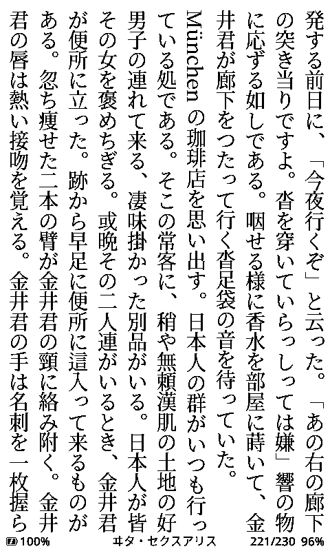
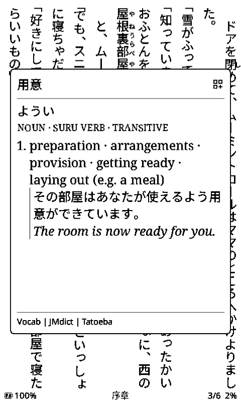
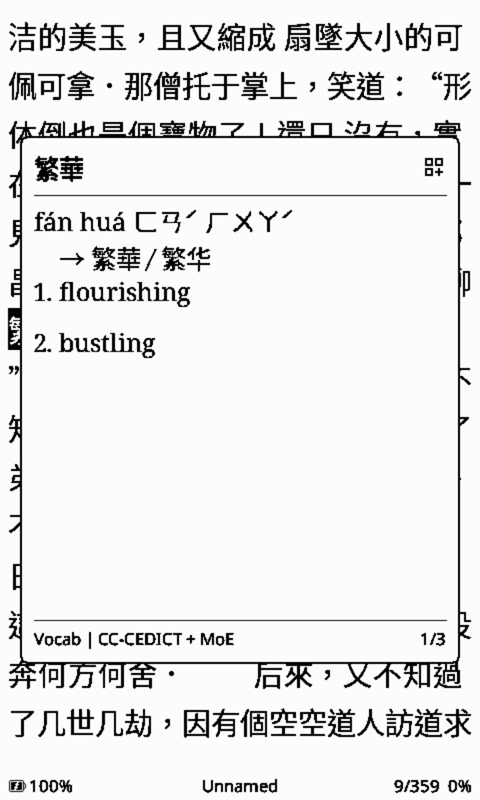
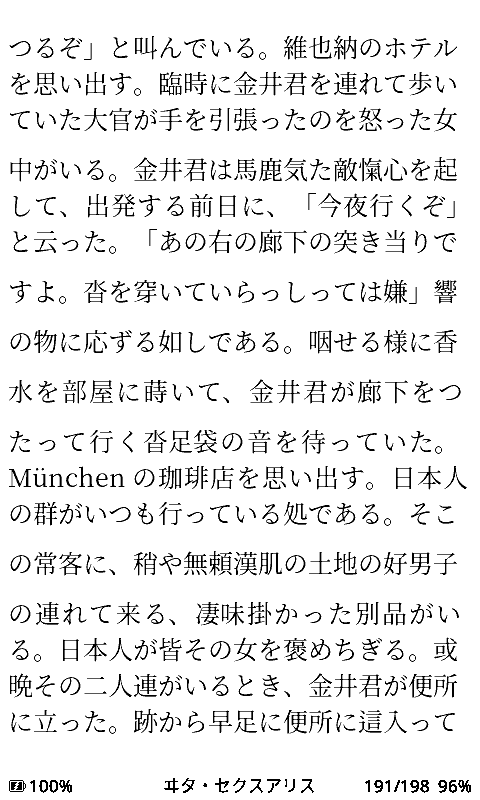
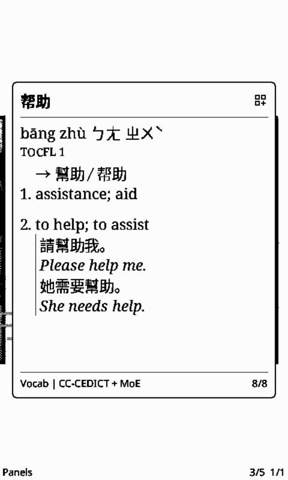
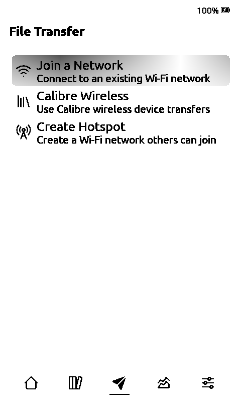

# Matcha Reader, a language-learning fork of CrossPoint

A fork of [CrossPoint](https://github.com/crosspoint-reader/crosspoint-reader) e-reader firmware, built for reading books and comics in a language you are learning. It is set up first for **Japanese** and **Chinese** (Mandarin, simplified or traditional, and Cantonese), and gives learners of French, English and other languages the same lookup, sentence-mining and translation tools.

It includes everything in upstream CrossPoint. You can try it in the [simulator](https://github.com/eszter007/crosspoint-simulator-ios) first, on a desktop or an iPhone, with no device.

<p align="center">
  
  
  
  
</p>

**Runs on:** Xteink X4, X3, X4 Pro and X4 Classic, Seeed reTerminal Sticky, M5PaperMono, Metalio 3.97".

This page is the short version. How to use everything is in the [User Guide](USER_GUIDE.md).

## What each learner gets

| | Japanese | Mandarin, simplified | Mandarin, traditional | Cantonese | Other languages |
| --- | --- | --- | --- | --- | --- |
| Word lookup | Page split into words, conjugations undone | Page split into words | Same | Same | Word by word, with word-form rules |
| Reading shown | Kana | Pinyin, HSK level | Pinyin, zhuyin, TOCFL level | Pinyin, jyutping | none |
| Dictionary | Jitendex / JMdict, names, grammar | CC-CEDICT | CC-CEDICT + MoE 重編國語辭典 | CC-Canto + CC-CEDICT | Any StarDict |
| Text layout | Vertical by default | Horizontal | Vertical for right-to-left books | As traditional | Horizontal |
| Readings above the text | Furigana | Pinyin | Pinyin or zhuyin | none | none |
| Font | Built in | SD font required | SD font required | SD font required | Built in |

Comics, sentence mining and page translation work in every column.

## Features

### Word lookup

Look up any word on the page, in vertical or horizontal text. In Japanese and Chinese the page is scanned first, so the cursor only lands on words that have an entry. The definition opens in a panel floating over the page. On a touch device, long-press a word to open it directly. See [Guide §6.1](USER_GUIDE.md#61-word-lookup).

<p align="center">
  
  
  
</p>

**Sentence mining.** Save a looked-up word with its sentence, ready for Anki. Each save adds a line to a CSV per language (`sentences-ja.csv`, `sentences-zh.csv`, …) that Anki imports as is. See [Guide §6.1](USER_GUIDE.md#sentence-mining).

**Page translation.** Translates the current page to English with Gemini, in the same panel. Needs Wi-Fi and your own API key. See [Guide §6.2](USER_GUIDE.md#62-page-translation).

<p align="center"></p>

### For Japanese learners

- **Vertical text**, detected from the book: right-to-left columns, kinsoku line breaking, emphasis marks and furigana. Both the layout and the furigana can be switched per book.
- **Conjugations resolve to the dictionary form**: 読んで becomes 読む, 食べませんでした becomes 食べる.
- **Vocabulary, names and grammar** each come from their own dictionary.
- **Furigana for books that have none**: a script adds it to the EPUB on your computer.
- **A font is built in.** An SD font looks better and adds rare kanji.

<p align="center">
  
  
</p>
<p align="center"><em>The same passage, Vertical Text on and off</em></p>

See [Guide §6.3](USER_GUIDE.md#63-japanese-books).

### For Chinese learners

- **Words are split by frequency**, not longest match, so 结婚的和尚未结婚的 reads 和 + 尚未, not 和尚.
- **Simplified** books show pinyin and the HSK level. **Traditional** books add zhuyin, the TOCFL level and a monolingual MoE entry, and open vertically when the book is right-to-left. **Cantonese** has its own dictionary and shows jyutping.
- **Both scripts are indexed**, so one dictionary serves simplified and traditional books.
- **A wrong language tag is caught**: the book is recognised from its text, and **Book Language** re-tags it by hand.
- **Pinyin or zhuyin above the text**: a script adds it to the EPUB on your computer.
- **An SD font is required**: the built-in CJK glyphs are the Japanese set.

<p align="center"></p>

See [Guide §6.4](USER_GUIDE.md#64-chinese-books).

### For learners of other languages

Any StarDict dictionary works, picked by the book's language, with no conversion. A lookup that misses is retried with word-form rules: fullest for French (`l'eau` → `eau`, `journaux` → `journal`, `parlaient` → `parler`), plurals and verb endings elsewhere. See [Guide §6.5](USER_GUIDE.md#65-books-in-other-languages).

### Manga, manhua and comics

Read panel by panel, each scaled to fill the screen, and look up any word right in the speech bubble. Lookup works offline.

**To convert a book, open [Matcha Reader Tools](https://eszter007.github.io/matcha-reader-tools/) in your browser**, drop in the CBZ, ZIP or PDF and copy the folder it gives you to the card. Nothing to install. See [Guide §6.6](USER_GUIDE.md#66-manga-manhua-and-comics).

<p align="center">
  
  
  
  
</p>
<p align="center"><em>Japanese manga</em></p>

<p align="center">
  
  
</p>
<p align="center"><em>Chinese manhua</em></p>

### Library and home

Every book on the card as a cover grid, manga beside EPUBs, with a **Shelves** tab for folders. The **Cover Grid** theme adds a tab bar for Home, Library, File Transfer, Insights and Settings. Long-press a cover for stats, Mark as Read and Delete. CrossPoint's own list view is still there. See [Guide §3.1](USER_GUIDE.md#31-home-screen) and [§3.4](USER_GUIDE.md#34-library-screen).

<p align="center">
  
  
  
  
  
</p>

### Reading stats

Streak, minutes this week, books finished and a calendar, split by language. Each book has its own stats, and finishing one opens a summary with the next books in its folder. See [Guide §7](USER_GUIDE.md#7-reading-stats).

<p align="center">
  
  
  
</p>

### Transparent sleep screen

A wallpaper laid over the page you were reading, so the book shows through. See [Guide §3.7](USER_GUIDE.md#37-sleep-screen).

<p align="center"></p>

### Also in this fork

- Reader settings remembered per book
- **Optimize EPUB** on upload: splits single-file novels into chapters and fits images to the screen
- More of the book's own CSS: heading sizes, line spacing, page breaks, boxed asides, drop caps, margins
- Instant image page turns
- A **Power + Up** shortcut to sync the clock (Settings → Controls → Shortcuts)
- Next-book suggestions at the end of every book
- A file browser that shows everything on the card
- Fully localised, in all the languages CrossPoint ships

## Setup

You need a computer, a USB-C cable and the device's SD card. Files go onto the card either with a card reader or over Wi-Fi from the device's **File Transfer** screen.

**1. Flash the firmware.**

1. Download the file for your device from [this repository's latest release](https://github.com/eszter007/matcha-reader/releases/latest):

   | Device | File |
   | --- | --- |
   | X3, and X4 (old) | `x4old-x3-firmware.bin` |
   | X4C (new) | `x4c-firmware.bin` |
   | X4 Pro | `x4pro-firmware.bin` |
   | Sticky | `sticky-firmware.bin` |
   | Papermono | `papermono-firmware.bin` |

2. Connect the device by USB-C and wake it.
3. Open the [CrossPoint flash tool](https://crosspointreader.com/#flash-tools), select your device, click **Custom .bin** and choose the file.

Some units bought from third-party stores are USB-locked and must be unlocked first. See [USB-locked devices](https://github.com/crosspoint-reader/crosspoint-reader#usb-locked-devices-xteink-unlocker) upstream. After the first flash, **Settings → System → Check for updates** installs new Matcha releases over Wi-Fi.

**2. Install a dictionary** for each language you read. The book's language picks the folder by itself.

| Language | What to do |
| --- | --- |
| Japanese | Download `japanese-dictionaries.zip` from the [latest release](https://github.com/eszter007/matcha-reader/releases/latest) and put the files from its `dict` folder in `dictionaries/jp/` |
| Mandarin | Download the simplified or the traditional pack from the [`dictionaries-zh` release](https://github.com/eszter007/matcha-reader/releases/tag/dictionaries-zh) and unzip it so the card holds `dictionaries/zh/`. Install one, not both |
| Cantonese | Convert CC-Canto and CC-CEDICT with the [browser tool](https://eszter007.github.io/matcha-reader-tools/) into `dictionaries/yue/` |
| Any other | Copy a StarDict dictionary into `dictionaries/<lang>/<name>/`, for example `dictionaries/fr/larousse/` |

To convert your own, use the [browser tool](https://eszter007.github.io/matcha-reader-tools/). Step by step: [docs/dictionary-setup.md](docs/dictionary-setup.md).

**3. Install a font** (required for Chinese, optional for Japanese). Download the zip for your language from the [releases](https://github.com/eszter007/matcha-reader/releases) and copy the `fonts` folder inside it to the root of the card.

| You read | Zip | Fonts |
| --- | --- | --- |
| Japanese | `japanese-fonts.zip` | Noto Sans JP, Noto Serif JP |
| Mandarin, simplified | `chinese-fonts-simplified.zip` | Noto Sans SC, Noto Serif SC |
| Mandarin, traditional, and Cantonese | `chinese-fonts-traditional.zip` | Noto Sans TC, Noto Serif TC |

The Chinese zips are attached from 1.7.0-nightly-1 on. To convert another font, use the [browser tool](https://eszter007.github.io/matcha-reader-tools/); details in [docs/sd-card-fonts.md](docs/sd-card-fonts.md).

**4. Copy your books** anywhere on the card and open them from the Library. Manga and comics are converted first, with the browser tool or as in [docs/manga-conversion.md](docs/manga-conversion.md).

**5. Optional extras.**

- **Interface language:** Settings → System → Language. Languages marked *Needs pack* need `language-packs.zip` from the release. See [Guide §3.9](USER_GUIDE.md#39-language-packs-sd-card).
- **Page translation:** save a key from [Google AI Studio](https://aistudio.google.com/apikey) as `/system/gemini.key` on the card.

## Building from source

```bash
git clone --recursive https://github.com/eszter007/matcha-reader.git
cd matcha-reader
pio run              # build
pio run -t upload    # flash
```

More, including running in the simulator: [docs/building.md](docs/building.md). Development notes are in [CLAUDE.md](CLAUDE.md).

## Compatibility with upstream

This fork tracks upstream CrossPoint and merges new releases. Nearly everything is additive, so merges stay cheap.

## Credits

Built on [CrossPoint](https://github.com/crosspoint-reader/crosspoint-reader), open-source e-reader firmware, community-built and fully hackable.

Dictionary data from [JMdict](https://www.edrdg.org/jmdict/j_jmdict.html) and [Jitendex](https://github.com/stephenmk/Jitendex), under their respective licences. Icons by [Tabler Icons](https://tabler.io/icons) (MIT). Sleep and boot screen logo by [ふにゃ猫 / funyaneko](https://iconbu.com/).
