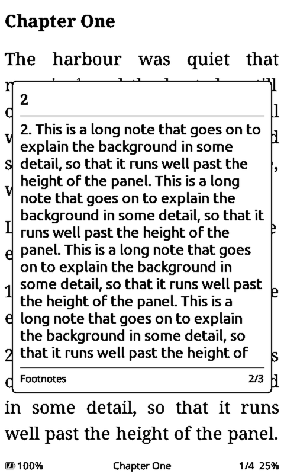
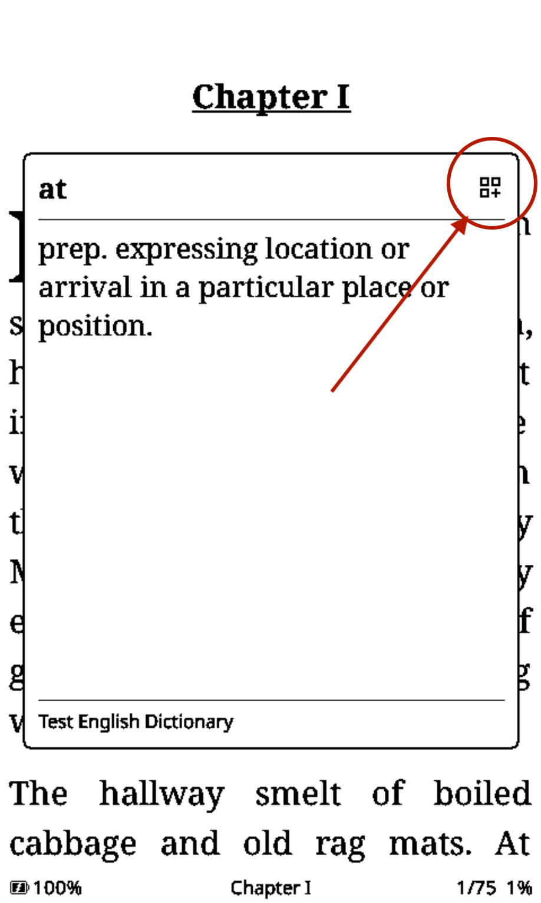
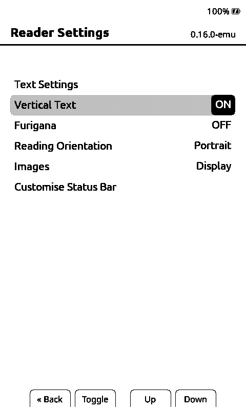
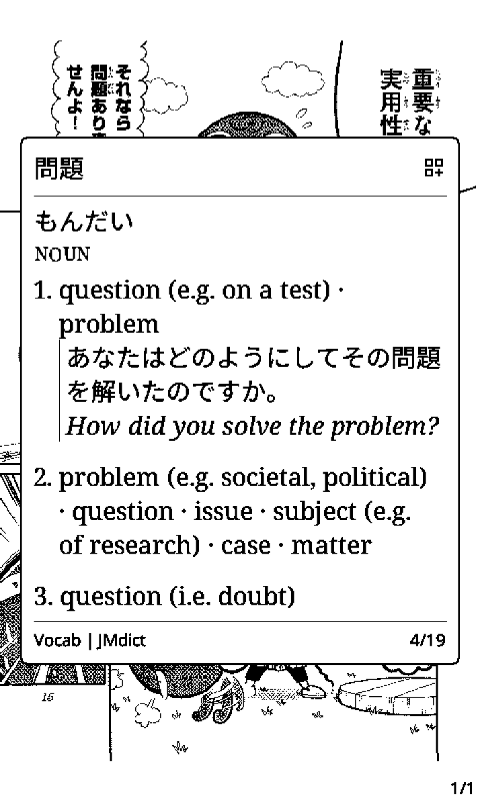
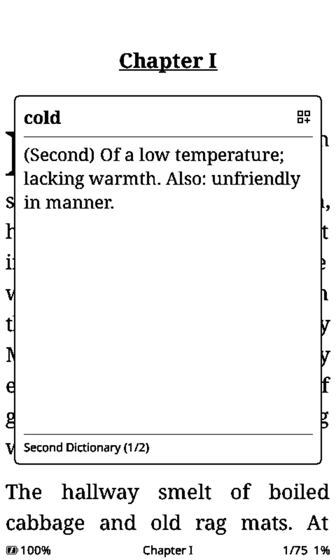
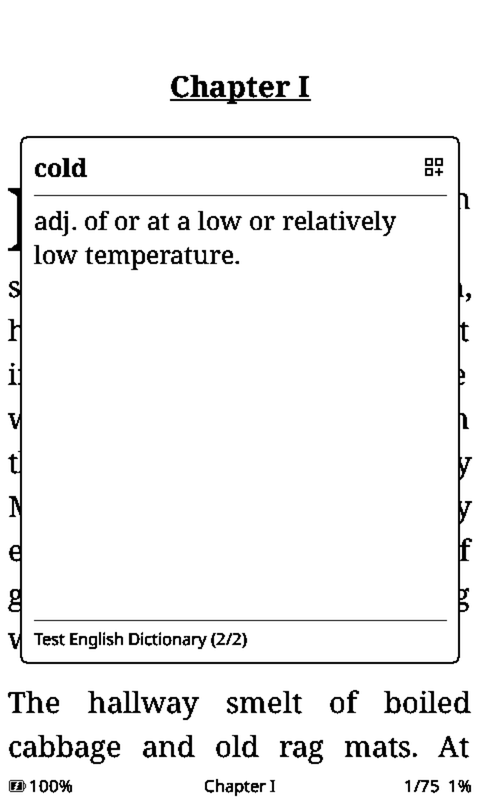
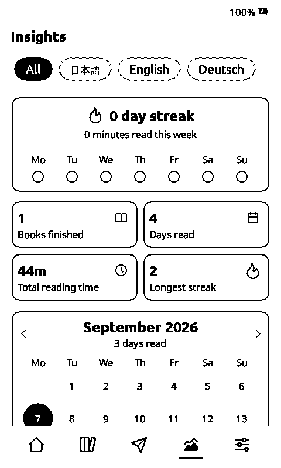
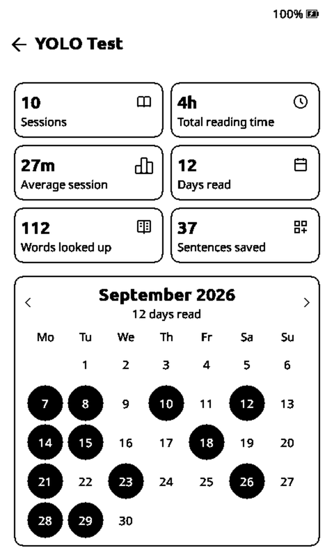
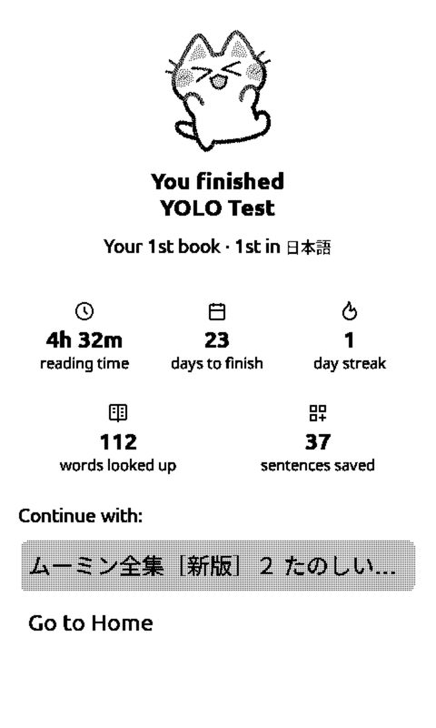

# CrossPoint User Guide

Welcome to the **CrossPoint** firmware. This guide outlines the hardware controls, navigation, and reading features of the device.

> [!TIP]
> Japanese and Chinese dictionaries, fonts, and manga or manhua all need converting before the device can read them.
> [**Matcha Reader Tools**](https://eszter007.github.io/matcha-reader-tools/) does all three in your browser and
> gives you a zip laid out for the SD card, with no Python to install. Files stay on your machine, except manga
> OCR, which sends panels to Gemini under your own API key.
> ([source](https://github.com/eszter007/matcha-reader-tools))

- [CrossPoint User Guide](#crosspoint-user-guide)
  - [1. Hardware Overview](#1-hardware-overview)
    - [Button Layout](#button-layout)
    - [Taking a Screenshot](#taking-a-screenshot)
    - [Syncing the Clock](#syncing-the-clock)
    - [Frontlight (X4 Pro only)](#frontlight-x4-pro-only)
  - [2. Power \& Startup](#2-power--startup)
    - [Power On / Off](#power-on--off)
    - [First Launch](#first-launch)
  - [3. Screens](#3-screens)
    - [3.1 Home Screen](#31-home-screen)
      - [3.1.1 Tabs and Button Navigation (Cover Grid theme)](#311-tabs-and-button-navigation-cover-grid-theme)
    - [3.2 Reading Mode](#32-reading-mode)
    - [3.3 Browse Files Screen](#33-browse-files-screen)
    - [3.4 Library Screen](#34-library-screen)
    - [3.5 File Transfer Screen](#35-file-transfer-screen)
    - [3.5.1 Calibre Wireless Transfers](#351-calibre-wireless-transfers)
      - [Installing the Plugin in Calibre](#installing-the-plugin-in-calibre)
      - [Configuring the CrossPoint Plugin in Calibre](#configuring-the-crosspoint-plugin-in-calibre)
      - [Uploading Books](#uploading-books)
      - [Removing a Book](#removing-a-book)
    - [3.6 Settings](#36-settings)
      - [3.6.1 Display](#361-display)
      - [3.6.2 Reader](#362-reader)
      - [3.6.3 Controls](#363-controls)
      - [3.6.4 System](#364-system)
      - [3.6.5 OPDS Servers (Multiple Libraries)](#365-opds-servers-multiple-libraries)
      - [3.6.6 Web Settings (Wi-Fi + OPDS)](#366-web-settings-wi-fi--opds)
      - [3.6.7 KOReader Sync Quick Setup](#367-koreader-sync-quick-setup)
        - [Option A: CrossPoint Sync Server (`sync.crosspointreader.com`, default)](#option-a-crosspoint-sync-server-synccrosspointreadercom-default)
        - [Option B: Legacy Public KOReader Server (`sync.koreader.rocks`)](#option-b-legacy-public-koreader-server-synckoreaderrocks)
        - [Option C: Self-Hosted Server (Docker Compose)](#option-c-self-hosted-server-docker-compose)
        - [Syncing While Reading](#syncing-while-reading)
    - [3.7 Sleep Screen](#37-sleep-screen)
      - [Cover settings](#cover-settings)
      - [Custom images](#custom-images)
      - [Transparent sleep screen](#transparent-sleep-screen)
    - [3.8 Custom Fonts (SD Card)](#38-custom-fonts-sd-card)
    - [3.9 Language Packs (SD Card)](#39-language-packs-sd-card)
  - [4. Reading Mode](#4-reading-mode)
    - [Page Turning](#page-turning)
    - [Chapter Navigation](#chapter-navigation)
    - [Auto Page Turn](#auto-page-turn)
    - [Tilt Page Turn (X3 only)](#tilt-page-turn-x3-only)
    - [Links and footnotes](#links-and-footnotes)
    - [Dictionary Lookup](#dictionary-lookup)
    - [System Navigation](#system-navigation)
    - [Supported Languages](#supported-languages)
  - [5. Reader Menu](#5-reader-menu)
      - [5.1 Chapter Selection](#51-chapter-selection)
      - [5.2 Bookmarks](#52-bookmarks)
  - [6. Language Learning Features](#6-language-learning-features)
    - [6.1 Word Lookup](#61-word-lookup)
    - [6.2 Page Translation](#62-page-translation)
    - [6.3 Japanese Books](#63-japanese-books)
    - [6.4 Chinese Books](#64-chinese-books)
    - [6.5 Books in Other Languages](#65-books-in-other-languages)
    - [6.6 Manga, Manhua and Comics](#66-manga-manhua-and-comics)
    - [6.7 Dictionary Files and Language Selection](#67-dictionary-files-and-language-selection)
  - [7. Reading Stats](#7-reading-stats)
    - [7.1 Insights](#71-insights)
    - [7.2 Per-book Stats](#72-per-book-stats)
    - [7.3 What the Numbers Do Not Cover](#73-what-the-numbers-do-not-cover)
  - [8. Current Limitations & Roadmap](#8-current-limitations--roadmap)
  - [9. Troubleshooting Issues & Escaping Bootloop](#9-troubleshooting-issues--escaping-bootloop)

## 1. Hardware Overview

The device utilises the standard buttons on the Xteink X4 (in the same layout as the manufacturer firmware, by default):

### Button Layout

| Location        | Buttons                                              |
| --------------- | ---------------------------------------------------- |
| **Bottom Edge** | **Back**, **Confirm**, **Left**, **Right**           |
| **Right Side**  | **Power**, **Side Up**, **Side Down**, **Reset** |

Button layout can be customized in the **[Controls Settings](#363-controls)**.

### Taking a Screenshot

When the Power button and the lower side button (Side Down) are pressed at the same time, it will take a screenshot and save it in the folder `screenshots/`.

Alternatively, while reading a book, press the **Confirm** button to open the reader menu and select **Take screenshot**.

### Syncing the Clock

Switch on **Power + Up Syncs Clock** under Settings → Controls → Shortcuts (off by default). Then pressing the Power button and the upper side button (Side Up) at the same time sets the clock from the internet, on any screen. If Wi-Fi is not connected yet, the network list opens first. Press **Back** when the new time is shown; from a book you return to the book.

Devices without a clock chip (the X4) drift while asleep and lose the time on a restart, which skews the reading stats; a sync puts it right. The same action is in the clock settings.

### Frontlight (X4 Pro only)

The X4 Pro has a built-in frontlight with adjustable brightness and warmth. It is controlled from a swipe panel rather than the Settings menu:

* **Open or close the frontlight panel:** Swipe down from the top edge of the screen, from almost any screen (Home, Browse Files, Reading Mode, etc.). Drag the brightness and warmth sliders to adjust the light live, or tap the sun icon to turn it on or off. The same swipe (or a status-bar tap) closes the panel again, as does the **Back** button.
* **Adjust brightness with the buttons:** While the panel is open, the **Up**/**Down** side buttons and the page-turn buttons step the brightness. Hold one to ramp continuously. On devices with edge-mounted side buttons the direction follows the physical layout, so the upper button always brightens.
* **Quick toggle:** Double-click the **Power** button to turn the frontlight on or off instantly, without opening the panel.

> [!NOTE]
> Frontlight brightness and warmth are intentionally not listed in **[Display Settings](#361-display)** — the swipe panel is the only place to adjust them. The on/off state can also be toggled with the Power-button double-click above.

If the frontlight doesn't come back on after the device wakes from sleep, check **Restore Light on Wake** in **Settings → Display → Sleep** (on by default). Turning it off is intentional if you'd rather have the light stay off on wake and switch it on yourself each time — but it's easy to forget you changed it.

---

## 2. Power & Startup

### Power On / Off

To turn the device on or off, **press and hold the Power button for approximately half a second**.
In the **[Controls Settings](#363-controls)** you can configure the power button to turn the device off with a short press instead of a long one.

To reboot the device (for example after a firmware update or if it's frozen), press and release the Reset button, and then quickly press and hold the Power button for a few seconds.

### First Launch

Upon turning the device on for the first time, you will be placed on the **[Home](#31-home-screen)** screen.

> [!NOTE]
> On subsequent restarts, the firmware will automatically reopen the last book you were reading.

---

## 3. Screens

### 3.1 Home Screen

The Home screen is the main entry point to the firmware. From here you can navigate to **[Reading Mode](#4-reading-mode)** with the most recently read book, **[Browse Files](#33-browse-files-screen)**, the **[Library](#34-library-screen)**, **[File Transfer](#35-file-transfer-screen)**, or **[Settings](#36-settings)**.

In the **Cover Grid** theme the Home screen is a grid of covers instead of a menu: the book you are reading fills a card
across the top and the rest follow below it. Covers are made in the background the first time the device sees a book, so
the grid appears straight away with titles in place of the artwork it has not built yet, and each cover replaces its own
title as it finishes. Nothing blocks while this happens, and a button press stops the conversion rather than waiting for
it. A cover that could not be built is retried the next time you visit Home.

Long press a cover, here, in the Library or inside a shelf, for **View Stats**, **Mark as Read** / **Mark as Unread**
and **Delete**. Without a touch panel, select the cover and hold **Confirm** for a second; letting go leaves the menu
open.
Only the direction that changes something is offered, so a finished book has no **Mark as Read**. Delete asks first and
takes the book's reading cache with it.

#### 3.1.1 Tabs and Button Navigation (Cover Grid theme)

The Cover Grid theme carries a tab bar along the bottom of Home, Library, File Transfer, Insights and Settings. It stays
put as you move between them, and the tab you are in is drawn filled. Nothing opens on top of anything else, so there is
no stack to back out of.

On a touch device, tap a tab. On a button-only device the bar is part of one navigation ring, so every control on the
screen is reachable without leaving it:

- **Up / Side Up** and **Down / Side Down** walk the ring: the screen's own tabs at the top (where it has them), then its
  rows or covers, then the bottom bar, and round again.
- **Confirm** on a screen's own tabs steps to the next one — **Books**, **Shelves**, **OPDS**, **Files** in the Library, the
  categories in Settings, the languages in Insights — and past the last one it moves the cursor into the bottom bar.
- **Left** and **Right** on a screen's own tabs step to the previous or next one. Once the cursor is in the bottom bar
  they move between Home, Library, File Transfer, Insights and Settings. **Confirm** goes to the highlighted tab;
  **Confirm** on the tab you are already in hands the cursor back to the first tab at the top of the screen, closing
  the ring.
- **Back** still leaves the screen, and holding it still goes Home.

A grey outline marks whatever the cursor is on, whether that is a cover, a row or a tab.

### 3.2 Reading Mode

See [Reading Mode](#4-reading-mode) below for more information.

### 3.3 Browse Files Screen

The Browse Files screen acts as a file and folder browser. The full path to the current directory is shown at the top of the screen. File extensions are displayed alongside each filename, and directories are shown with brackets (e.g. `[folder-name]`). Hidden entries — those beginning with `.` — appear only when **Settings → Display → Show Hidden Files** is enabled. Turning it on is also what makes the folders macOS leaves behind on a card (`.Spotlight-V100`, `.Trashes`) selectable, so they can be deleted. `System Volume Information` stays hidden either way.

* **Navigate List:** Use **Left** (or **Side Up**), or **Right** (or **Side Down**) to move the selection cursor up and down through folders and books. You can also long-press these buttons to scroll a full page up or down.
* **Open Selection:** Press **Confirm** to open a folder or start reading a selected book. Selecting a `.bmp` file will open the image viewer.
* **Delete Files or Folders:** Hold and release **Confirm** to delete the selected file or folder. You will be given an option to either confirm or cancel. Multiple files can be selected for deletion in a single operation. Deleting a folder removes everything inside it.
* **Rename or Move:** Files can be renamed or moved to a different folder from within the browse screen.

In the **Cover Grid** theme this screen is the Library's **Files** tab rather than its own entry on the home menu, so it
keeps the **Books / Shelves / OPDS / Files** tabs at the top and the bottom tab bar. The back arrow in the header appears only
once you are inside a folder; at the card root the tabs are the way out. Every other theme keeps **Browse Files** as a
separate home entry, exactly as before.

### 3.4 Library Screen

Matcha ships two Library screens and **Settings → Display → Library → Library View** chooses between them. **Matcha Covers**, the
default, is a grid of book covers described in the README. **CrossPoint List** is the indexed list documented below.
Everything in this section applies to the list view.

The Library indexes up to 4,096 supported books on the SD card and shows their titles and authors without requiring you to remember their folders. Its four tabs provide different views. An arrow beside an indexed tab shows the sort direction:

- **Recent** lists the ten books you opened most recently. Hold a book to remove it from this list.
- **Added** keeps books in the order in which the Library first discovered them. Down shows newest additions first; up shows oldest first.
- **Title** groups books by the first letter of the title. Up sorts A-Z and down sorts Z-A. Titles beginning with numbers or punctuation appear under `#`; letters from non-English scripts, including Hebrew, have their own groups.
- **Author** groups books by author. Up sorts A-Z and down sorts Z-A.

On a button-only device:

- Use **Up/Down** or **Left/Right** to move one row at a time. Hold a direction to move a page at a time.
- Press **Confirm** to open the selected book.
- Press **Back** from the book list to focus the tabs. Use **Left/Right** to select another tab, press **Confirm** to reverse its sort direction, or press **Down** to return to the list.
- While the tabs are focused, hold **Confirm** to open Search.
- In the Title or Author views, hold **Confirm** on a book to collapse the list to its letter or author groups. The matching group remains selected. Press **Confirm** to enter a group, or **Back** to restore the exact book and position you came from.

On a touch device, tap tabs, books, and the Search icon directly. Tap an active indexed tab again to reverse its sort direction. Swipe to scroll. Long-press a book in the Recent view to remove it from the list. Long-press a book in a Title or Author view to collapse to the group list, then tap a group to expand it. The **Added** view is not grouped; tapping or long-pressing a book opens it.

The index is created automatically the first time the list view is opened. To pick up later file changes or updated metadata, use **Settings → Display → Library → Rebuild library index**. The **Use book metadata** setting in the same place controls whether the index reads titles and authors stored inside books.

### 3.5 File Transfer Screen

The File Transfer screen allows you to upload and manage files on the device. When you enter the screen, choose **Join a Network**, **Calibre Wireless**, or **Create Hotspot**. The reader then starts the web server for the selected mode.

See the [web server docs](./docs/webserver.md) for more information on how to connect to the web server and upload files.

The web interface also supports **WebDAV**, allowing you to mount the device as a network drive and manage files directly from your computer's file manager.

Download links for files already on the device are available in the web interface, so you can retrieve books or screenshots over Wi-Fi without connecting a cable.

A **Wi-Fi signal strength indicator** (dBm) is displayed on-screen during joined-network web server sessions.

> [!TIP]
> Advanced users can also manage files programmatically or via the command line using `curl`. See the [web server docs](./docs/webserver.md) for details.
> [!TIP]
> If your EPUBs have compatibility issues, you can run the built-in **EPUB Optimizer** directly from the device to clean up and reprocess books for better rendering.

### 3.5.1 Calibre Wireless Transfers

CrossPoint supports sending books from Calibre using the CrossPoint Reader device plugin.

#### Installing the Plugin in Calibre

If you don't already have the plugin installed:

1. Head to https://github.com/crosspoint-reader/calibre-plugins/releases to download the latest version of the crosspoint_reader plugin.
2. Download the zip file.
3. Open Calibre → Preferences → Plugins → Load plugin from file → Select the zip file.
4. Restart Calibre.

#### Configuring the CrossPoint Plugin in Calibre
1. In Calibre select Preferences.
2. In the Preferences dialog select Plugins.
3. In Plugins search for "crosspoint".
4. Click on "Customize plugin".
5. Update the value for "Host" to match the IP for your device.
6. Leave the other settings as they are.
7. [optional] Modify the "Upload path" to point to a subfolder other than the root "/" folder. Enter this as a path relative to the root folder. Example: `/mybooks`
8. Restart Calibre.


#### Uploading Books

To upload a book using the CrossPoint plugin in Calibre:

1. On the device: File Transfer -> Calibre Wireless, then join a network.
2. Select one or more books.
3. Right-click on that selection.
4. Select "Send to Device" > "Send to main memory"

The CrossPoint plugin will connect to your device, create a folder for the book's author in the root folder (or the folder you configured for the plugin), then copy the book into that folder.


#### Removing a Book

Books cannot be removed from your device through Calibre. Use the web interface instead.

### 3.6 Settings

The Settings screen allows you to configure the device's behavior. There are a few settings you can adjust:

Settings that are simply on or off show a switch on the right of their row instead of the words "ON" and "OFF" —
selecting the row flips it in place. Settings with more than two choices still show their current value as text and
open a list when selected.

#### 3.6.1 Display

- **Library**: Opens the library settings, gathered on one screen:
  
  - **Library View**: Which screen the Library entry opens — "Matcha Covers" (default), the cover grid, or
    "CrossPoint List", the indexed title/author list described in [Library Screen](#34-library-screen)
  - **Rebuild library index**: Re-scan the card to pick up file changes and updated metadata
  - **Clear Read Books from Recent List**: Drop a book from the Recent tab once you finish it
  - **Move finished books to Read**: Move a finished book into a `Read` folder
  - **Use book metadata**: Read the title and author stored inside each book when the index is rebuilt.
    When disabled or unavailable, the filename is used
  
  Three of those only affect the CrossPoint List screen and are hidden while Matcha Covers is
  selected, leaving Library View and Move finished books to Read: the index rebuild and the
  metadata toggle both feed the list's index, which the cover grid does not use, and the cover
  grid shows every book the card scan finds rather than a recent list.

- **Sleep**: Opens the sleep settings, gathered on one screen, in this order: Sleep Screen, Sleep Screen Cover Mode,
  Sleep Screen Cover Filter, Quick Resume on Timeout, Time to Sleep, and Restore Light on Wake (described under
  [Frontlight](#frontlight-x4-pro-only)). They live there rather than in the Display list itself; each is described
  below.

- **Sleep Screen**: Which sleep screen to display when the device sleeps:
  
  - "Dark" (default) - The default dark Crosspoint logo sleep screen
  - "Light" - The same default sleep screen, on a white background
  - "Custom" - Custom images from the SD card; see [Sleep Screen](#37-sleep-screen) below for more information
  - "Cover" - The book cover image (Note: this is experimental and may not work as expected)
  - "None" - A blank screen
  - "Cover + Custom" - The book cover image while actively reading, falls back to "Custom" behavior otherwise
  - "Quick resume" - The text of the last page read will be displayed on the sleep screen and a moon icon is shown on the edge of the screen. Waking up the device will return to the same page of the opened book. This is useful for quickly resuming reading without waiting for the device to fully wake up and load the book.
  - "Transparent" - A transparent overlay image drawn over the current screen; see [Sleep Screen](#37-sleep-screen) below for more information
- **Sleep Screen Cover Mode**: How to display the book cover when "Cover" sleep screen is selected:
  
  - "Fit" (default) - Scale the image down to fit centered on the screen, padding with white borders as necessary
  - "Crop" - Scale the image down and crop as necessary to try to fill the screen (Note: this is experimental and may not work as expected)

- **Sleep Screen Cover Filter**: What filter will be applied to the book cover when "Cover" sleep screen is selected:
  
  - "None" (default) - The cover image will be converted to a grayscale image and displayed as it is
  - "Contrast" - The image will be displayed as a black & white image without grayscale conversion
  - "Inverted" - The image will be inverted as in white & black and will be displayed without grayscale conversion

- **Quick Resume on Timeout**: Whether to enable the "Quick Resume" sleep screen when the device goes to sleep due to inactivity (Time to Sleep, below). This is useful for quickly resuming reading without waiting for the device to fully wake up and load the book. This overwrites the Sleep Screen Cover Mode when enabled.

- **Time to Sleep**: Set the duration of inactivity before the device automatically goes to sleep; options are 1, 3, 5, 10 (default), 15 or 30 minutes.

- **Status Bar**: Configure the status bar displayed while reading:
  
  - "None" - No status bar
  - "No Progress" - Show status bar without reading progress
  - "Full w/ Percentage" - Show status bar with book progress (as percentage)
  - "Full w/ Book Bar" - Show status bar with book progress (as bar)
  - "Book Bar Only" - Show book progress (as bar)
  - "Full w/ Chapter Bar" - Show status bar with chapter progress (as bar)

- **Hide Battery %**: Configure where to suppress the battery percentage display in the status bar; the battery icon will still be shown:
  
  - "Never" (default) - Always show battery percentage
  - "In Reader" - Show battery percentage everywhere except in reading mode
  - "Always" - Always hide battery percentage

- **Refresh Frequency**: Set how often the screen does a full refresh while reading to reduce ghosting; options are every 1, 5, 10, 15, or 30 pages. In manga each panel step counts as a page.

- **UI Theme**: Set which UI theme to use:
  
  - "Classic" - The original Crosspoint theme
  - "Lyra" - The new theme for Crosspoint featuring rounded elements and menu icons
  - "Lyra Extended" - Lyra, but displays 3 books instead of 1 on the **[Home Screen](#31-home-screen)**
  - "RoundedRaff" - A rounded theme with additional visual styling

- **Sunlight Fading Fix**: Configure whether to enable a software-fix for the issue where white X4 models may fade when used in direct sunlight:
  
  - "OFF" (default) - Disable the fix
  - "ON" - Enable the fix

#### 3.6.2 Reader

- **Reader Font Family**: Choose the font used for reading:
  
  - "Noto Serif" (default) - Google's serif font
  - "Noto Sans" - Google's sans-serif font
  - Installed SD card families

- **Reader Font Size**: Choose a point size. Built-in and direct TTF/OTF/TTC fonts offer 12, 14, 16, and 18 pt. A `.cpfont` family offers the sizes installed for that family.

- **Reader Line Spacing**: Adjust the spacing between lines; options are "Tight", "Normal" (default), or "Wide".

- **Reader Screen Margin**: Controls the screen margins in Reading Mode between 5 and 40 pixels in 5-pixel increments.

- **Vertical text**: while a book is shown vertically, Text Settings > Layout lists only **Line Spacing**, **Character spacing** and **Screen Margin**, the settings vertical layout uses. Character spacing (−2 px to +2 px) changes the step between characters down a column, so a tighter setting fits more characters per column. Horizontal books, Japanese ones included, show every Layout setting.

- **Use Book Margins**: Whether to keep the side margins a book sets for itself. Many books indent epigraphs, letters and long quotations; with this ON those blocks stay indented, and with it OFF they are set flush with the body text and only the Reader Screen Margin applies. Default is ON. Found under Text Settings > Layout.

- **Reader Paragraph Alignment**: Set the alignment of paragraphs; options are "Justified" (default), "Left", "Center", or "Right".

- **Embedded Style**: Whether to use the EPUB file's embedded HTML and CSS stylisation and formatting; options are "ON" or "OFF".

- **Hyphenation**: Whether to hyphenate text in Reading Mode; options are "ON" or "OFF". Korean text wraps only at spaces when "OFF"; when "ON", a Korean word may also wrap at the end of a line between syllables or where it meets digits, Latin letters, or brackets (no hyphen is drawn).

- **Reading Orientation**: Set the screen orientation for reading EPUB files:
  
  - "Portrait" (default) - Standard portrait orientation
  - "Landscape CW" - Landscape, rotated clockwise
  - "Inverted" - Portrait, upside down
  - "Landscape CCW" - Landscape, rotated counter-clockwise

- **Extra Paragraph Spacing**: Set how to handle paragraph breaks:
  
  - "ON" - Vertical space will be added between paragraphs in Reading Mode
  - "OFF" - Paragraphs will not have vertical space added, but will have first-line indentation

- **Paragraph Indentation** (Text Settings > Layout): How far the first line of a paragraph is indented, from "Off" to
  five spaces; two by default. It applies to horizontal text, and takes the place of an indent the book sets for
  itself (a hanging indent, where the book pulls the first line *out*, is kept). Vertical text is not affected.

- **Dictionary**: Select the StarDict dictionary used for word lookups while reading, or "None" to disable lookups. *(Only shown when at least one dictionary folder exists under `/dictionaries/` or `/.dictionaries/` on the SD card — see [docs/dictionary.md](docs/dictionary.md) for setup and usage.)*

- **Text Anti-Aliasing**: Whether to show smooth grey edges (anti-aliasing) on text in reading mode, horizontal and vertical (Japanese) text alike, furigana included. Note this slows down page turns slightly: the grey edges follow the black-and-white page about half a second later, and a page turn before then skips them. Images inside vertical text turn grayscale once you stay on the page, whether or not this is on.

- **Images**: Whether to display embedded images (JPG/PNG) found in EPUB files; options are "ON" (default) or "OFF".

- **Focus Reading**: Bolds the first part of each word to create visual fixation points, similar to Bionic Reading. This can help improve reading speed and focus; options are "ON" or "OFF" (default).

#### 3.6.3 Controls

- **Shortcuts**: Opens the button-shortcut settings, gathered on one screen: **Long-Press Button Behavior**,
  **Long-press Menu**, **Power + Up Syncs Clock**, **Short Power Button Click** and **Quick-return from footnotes**, plus **Upper Side Button
  in Reader** and **Lower Side Button in Reader** on the X3/X4, **Double-Click Power for Light** on the X4 Pro and
  **Tilt Page Turn** on the X3, with **Short Back to File Browser** last. Each is described
  below; the remaining entries in this section stay in the Controls list itself.

- **Remap Front Buttons**: A menu for customising the function of each bottom edge button.

- **Front Buttons Follow Orientation** (on by default): Directional buttons act on the direction you *see*, not the direction they point on the case. Rotate to landscape and the pair that used to move left/right moves up/down instead, with the on-screen hints relabelled to match — so page turns, list scrolling, the keyboard and the word lookup all keep working the way the screen is facing. Rotating swaps which axis each pair of buttons serves, so in landscape the front buttons take the up/down axis and the side buttons take left/right. Switch it off to keep every button fixed to its portrait meaning however the screen is turned. Devices with a touchscreen always follow the orientation and ignore this setting.

- **Navigate with Side Buttons in Word Lookup** (on by default): Lets the side buttons step between words during
  Word Lookup. See [Word Lookup](#61-word-lookup).

- **Haptic Feedback** (devices with a vibration motor only): A short tap when the device accepts a touch.
  "On Touch" covers taps, long presses and touch page turns; "On Touch + Page Turn" adds the capacitive page
  buttons; "Off" silences it. A touch that does nothing (a turn past the first page, a tap on the tab you are
  already in) stays silent.

- **Haptic Intensity**: Low, Medium or High.

- **Reversed page turn (Vertical & Manga)** (off by default): Flips which button turns the page forward, for the two things that are read right-to-left.

  - In a **vertical (tategaki) Japanese book**, the button that normally goes back turns forward instead.
  - In **manga**, the left button advances — into the page's panels and on through the pages — and the right button goes back.
  - A horizontal book in any language is **not** affected, even if you leave the toggle on after reading a Japanese one.

  This affects **page turning only**. Menus, the reader menu and Word Lookup keep their normal directions. It applies to the front buttons and the side buttons together. Unlike the per-book text settings this one is global: it lives in the Controls screen, so it is the same for every book. Touch page turns have their own setting — see **Touch Reader Controls**, which offers inverted tap and swipe modes for the same reason.

- **Upper / Lower Side Button in Reader** (X3/X4 only, in Shortcuts): Rebinds what the upper (Side Up) or
  lower (Side Down) button does while reading. Each offers Default (previous page on Upper, next page on Lower),
  Sleep, Previous Page, Next Page, Refresh Screen, Footnotes, Word Lookup and Off — so swapping the page-turn order
  is Upper = Next Page plus Lower = Previous Page, and Off on both is the old "Side Button Layout = Disabled".
  A device upgrading from an earlier version carries its old Side Button Layout over automatically.

  A button with a custom action does that action and nothing else: it no longer turns pages or steps lists under
  the shared roles, so it cannot fire two things at once. Outside the reader both buttons keep their ordinary
  navigation role. Inside Word Lookup the page bindings move the cursor — Previous Page steps back, Next Page
  steps forward, in the word list and through a definition's entries alike. A button bound to Word Lookup walks
  the same path as the power-button shortcut: the first click opens word selection, the second looks the
  highlighted word up, and a click in the definition view closes the dictionary — two clicks in, one click out,
  without moving your reading hand. The **Short Power Button Click** page bindings work inside Word Lookup too,
  so Power set to "Previous Page" steps back there as well.

  **Reversed Page Turn does not apply to a remapped button.** A button you set to "Next Page" advances in a
  vertical or manga book exactly as it does in a horizontal one — you named the direction yourself, so nothing
  flips it behind your back. The same holds for the Power button's page bindings. Reversed Page Turn keeps
  reversing the buttons still doing their *shared* page-turn job, which is what it is for.

  Only **Navigate with Side Buttons in Word Lookup** is hidden, and only once *both* side buttons are remapped —
  it is the one setting that merely arranges the shared side-button roles. **Reversed Page Turn** and
  **Long-Press Button Behavior** stay visible, since they also govern the front buttons, touch and tilt.

- **Long-Press Button Behavior**: Set whether long-pressing page turn buttons skips to the next/previous chapter:
  
  - "Chapter Skip" (default) - Long-pressing skips to next/previous chapter
  - "Page Scroll" - Long-pressing scrolls a page up/down
- **Long-press Menu**: Selects the function bound to holding the menu button (Confirm) while reading an EPUB. **Cycles through the available functions** each time the setting is selected — additional functions may be added in future releases, so this is not a binary on/off toggle. A short press of Confirm always opens the reader menu as normal:
  - "Bookmark" (default) - Hold Confirm (~0.4 second) to drop a bookmark at the current page.
  - "KOSync" - Hold Confirm (~1 second) to launch KOReader sync directly.
  - "Dictionary" - Hold Confirm (~0.4 second) to start dictionary word selection on the current page (see [docs/dictionary.md](docs/dictionary.md)).
  - "Disabled" - Long-press is ignored; only short-press opens the reader menu.

- **Power + Up Syncs Clock** (off by default): Pressing Power and Side Up together opens Sync Clock from any screen. See [Syncing the Clock](#syncing-the-clock).

- **Short Power Button Click**: Controls the effect of a short click of the power button:
  
  - "Ignore" (default) - Require a long press to turn off the device
  - "Sleep" - A short press puts the device into sleep mode
  - "Next Page" - A short press in reading mode turns to the next page; a long press turns the device off
  - "Previous Page" - A short press in reading mode turns back one page
  - "Links and footnotes" - A short press in reading mode opens the footnotes submenu; if only one footnote is present on the page, the referenced page is opened directly. The short press on the power button can be used to select the footnote in the submenu, and to go back to the original page after finish reading the footnote (like the back button).
  - "Refresh" - A short press triggers a manual full-screen refresh, useful for clearing ghosting
  - "Word Lookup" - A short press in reading mode opens word selection. A second press looks up the highlighted word, and a press in the definition view closes the dictionary and returns to the page — two presses in, one press out, without moving your reading hand.
  - "Confirm" - A short press acts as the Confirm button. It earns its place on touch devices, which have no front Confirm key.

- **Touch Reader Controls**: How the touchscreen turns pages while reading (touch devices only):
  
  - "Off" - The reading surface ignores touch entirely
  - "Tap" (default) - Tap the left third to go back, the right third to go forward
  - "Swipe" - Swipe horizontally to turn pages, leaving taps free for the reader menu
  - "Inverted Tap" - As "Tap", with the sides reversed. Useful for vertical Japanese text, which reads right-to-left
  - "Inverted Swipe" - As "Swipe", with the directions reversed, for the same reason

- **Tap For Reader Menu**: Opens the reader menu when you tap the centre of the screen. Only offered on devices with a Home key, where the menu stays reachable through the key's long-press function if you turn this off.

- **Quick return from links**: Toggles on and off the quick return functionality from the footnotes. When the functionality it's active, a short press of the power button will act as the back button from the footnotes page.

#### 3.6.4 System


- **Wi-Fi Networks**: Connect to Wi-Fi networks for file transfers and firmware updates.

- **KOReader Sync**: Options for setting up KOReader for syncing book progress. **Smart sync** is the default for new configurations and auto-resolves simple push/pull decisions. Existing credential files retain **Ask every time** when migrated; you can switch Sync Behavior at any time if you prefer manual confirmation.

- **OPDS Servers**: Manage one or more OPDS [(Open Publication Distribution System)](https://en.wikipedia.org/wiki/Open_Publication_Distribution_System) libraries for browsing and downloading books. See [OPDS Servers (Multiple Libraries)](#365-opds-servers-multiple-libraries) below.

- **Clear Reading Cache**: Clear the internal SD card cache.

- **Language**: Set the UI language. English, Japanese, Spanish, French and German are built into the firmware. The
  rest — Czech, Brazilian Portuguese, Russian, Swedish, Romanian, Catalan, Ukrainian, Belarusian, Italian, Polish,
  Finnish, Danish, Dutch, Turkish, Kazakh, Hungarian, Lithuanian, Slovenian, Valencian, Hebrew, Simplified and
  Traditional Chinese and more — are listed too, but marked **Needs pack** until you install a language pack. See
  [Language Packs (SD Card)](#39-language-packs-sd-card). A Chinese interface also needs a Chinese SD font (see
  [§6.4](#64-chinese-books)): the built-in CJK glyphs are the Japanese set, so menus would show boxes without one.

- **Keyboard Layouts**: Choose which on-screen keyboard layouts are offered when typing.

- **Plugins**: Lists the plugins installed on the SD card that have a screen on the device. A plugin is a folder
  on the card; adding or updating one needs no firmware update. See [docs/sd-plugins.md](docs/sd-plugins.md).

- **Check for updates**: Check for Crosspoint firmware updates over Wi-Fi.

- **SD Card Firmware Update**: Install firmware without a USB connection by placing a `firmware.bin` file on the SD card.

Rebuilding the library index moved to **Settings → Display → Library**, and **Manage Fonts** is at the bottom of the
font list inside **Text Settings**.

#### 3.6.5 OPDS Servers (Multiple Libraries)

CrossPoint supports saving multiple OPDS servers and switching between them when browsing catalogs.

In the **Cover Grid** theme the catalogs are the Library's **OPDS** tab: it lists your saved servers under the
**Books / Shelves / OPDS / Files** tabs, and choosing one opens its catalog (Wi-Fi connects only then, never just from
moving across the tabs). **Back** from the catalog's top level returns to the tab. **Add Server** is on the tab too; the
download folder and file name format stay in Settings. Other themes open the catalogs from the home menu, as before.

A catalog stays inside the tab layout, with the Library tabs above it and the bottom bar below; only the Wi-Fi
network picker takes the full screen. On a button-only device the cursor moves in one ring: **Up** from the first
entry reaches the Library tabs (**Left**/**Right** switch tab, **Confirm** goes on to **Files**), **Down** past the
last entry reaches the bottom bar. On an error screen or an empty catalog, **Up** and **Down** go straight to the tabs
and the bar.

1. Open **Settings -> System -> OPDS Servers**.

2. Select **Add Server** to create a new entry, or select an existing server to edit it.

3. Configure these fields:
   
   - **Server Name**: Optional display name (for example, "Home Calibre" or "Public Catalog").
   
   - **OPDS Server URL**: Full catalog root URL (for Calibre Content Server, usually ends with `/opds`).
   
   - **Username / Password**: Optional credentials for authenticated servers.

4. Use **Delete Server** inside a server entry to remove it.

Behavior notes:

- You can store up to 8 OPDS servers.
- OPDS authentication supports HTTP Basic auth. If you use Calibre Content Server with authentication enabled, set it to Basic (not Digest).

You can also manage OPDS servers from the web interface while in File Transfer mode:

1. Connect to the device web UI.
2. Open `http://<device-ip>/settings`.
3. Use the **OPDS Servers** card to add, edit, or delete entries.

For web-based Wi-Fi network management, see [Web Settings (Wi-Fi + OPDS)](#366-web-settings-wi-fi--opds).

#### 3.6.6 Web Settings (Wi-Fi + OPDS)

While in **File Transfer** mode, the web settings page includes management cards for both **Wi-Fi Networks** and **OPDS Servers**.

1. On device: open **File Transfer** and connect through **Join a Network** or **Create Hotspot**.
2. In a browser, open `http://<device-ip>/settings` or `http://crosspoint.local`.
3. In **Wi-Fi Networks**, add, edit, or delete saved network entries (SSID + optional password).
4. In **OPDS Servers**, add, edit, or delete OPDS catalogs.

Behavior notes:

- Passwords are never shown back in the web UI after saving.
- Leaving Password blank while editing keeps the existing saved password unchanged.
- The web UI can save hidden-network SSIDs, but connecting to hidden networks still depends on the device-side Wi-Fi connection flow.

#### 3.6.7 KOReader Sync Quick Setup

CrossPoint can sync reading progress with KOReader-compatible sync servers.
It also interoperates with KOReader apps/devices when they use the same server and credentials.

##### Option A: CrossPoint Sync Server (`sync.crosspointreader.com`, default)

When **Sync Server URL** is left empty, CrossPoint uses the free CrossPoint sync server at `https://sync.crosspointreader.com`. It speaks the standard KOReader sync protocol (so KOReader apps can use it too). CrossPoint records page starts as chapter-content offsets and sends the corresponding standard KOReader XPath, so devices with different fonts or layouts can return to the same text.

1. On each CrossPoint device:

   - Go to **Settings -> System -> KOReader Sync**.

   - Set **Username** and **Password** (enter the plain password; CrossPoint computes MD5 internally, and use the same values on all devices).

   - Leave **Sync Server URL** empty (or set it to `https://sync.crosspointreader.com`).

   - On the first device, run **Sign Up** once to create the account directly from the device. On every other device, just run **Authenticate**.

Accounts are per server. Existing `sync.koreader.rocks` credentials do not exist on the CrossPoint server; either sign up again with the same username/password or use Option B to keep using the legacy server.

##### Option B: Legacy Public KOReader Server (`sync.koreader.rocks`)

Use this if you already sync KOReader devices against the official public server.

1. On each CrossPoint device:

   - Go to **Settings -> System -> KOReader Sync**.

   - Set **Sync Server URL** to `https://sync.koreader.rocks` (required; an empty URL now points at the CrossPoint server instead).

   - Set **Username** and **Password** to your existing KOReader Sync credentials.

   - Run **Authenticate**.

2. If you do not have an account yet, run **Sign Up** on the device, or register once with curl:

```bash
USERNAME="user"
PASSWORD="pass"
PASSWORD_MD5="$(printf '%s' "$PASSWORD" | openssl md5 | awk '{print $2}')"

curl -i "https://sync.koreader.rocks/users/create" \
  -H "Accept: application/vnd.koreader.v1+json" \
  -H "Content-Type: application/json" \
  --data "{\"username\":\"$USERNAME\",\"password\":\"$PASSWORD_MD5\"}"
```

When this returns `HTTP 402` with `{"code":2002,"message":"Username is already registered."}`, pick a different username or use that existing account.

##### Option C: Self-Hosted Server (Docker Compose)

1. Start a sync server:

```bash
mkdir -p kosync-quickstart
cd kosync-quickstart

cat > compose.yaml <<'YAML'
services:
  kosync:
    image: koreader/kosync:latest
    ports:
      - "7200:7200"
      - "17200:17200"
    volumes:
      - ./data/redis:/var/lib/redis
    environment:
      - ENABLE_USER_REGISTRATION=true
    restart: unless-stopped
YAML

# Docker
docker compose up -d

# Podman (alternative)
podman compose up -d
```

> [!NOTE]
> `ENABLE_USER_REGISTRATION=true` is convenient for first setup. After creating your users, set it to `false` (or remove it) to avoid unexpected registrations.

2. Verify the server:

```bash
curl -H "Accept: application/vnd.koreader.v1+json" "http://<server-ip>:17200/healthcheck"
# Expected: {"state":"OK"}
```

3. Register a user once.
   CrossPoint authenticates against KOReader Sync (`koreader/kosync`) using an MD5 key, so register using the MD5 of your password:

> [!WARNING]
> Sending a reusable MD5-derived password over plain HTTP is insecure.
> Create unique sync-only credentials and do not reuse main account passwords.
> Prefer `https://<server-ip>:7200` whenever traffic leaves a fully trusted LAN or when using untrusted networks.
> Use `curl -k` only for self-signed certificate testing.

```bash
USERNAME="user"
PASSWORD="pass"
PASSWORD_MD5="$(printf '%s' "$PASSWORD" | openssl md5 | awk '{print $2}')"

curl -i "http://<server-ip>:17200/users/create" \
  -H "Accept: application/vnd.koreader.v1+json" \
  -H "Content-Type: application/json" \
  --data "{\"username\":\"$USERNAME\",\"password\":\"$PASSWORD_MD5\"}"
```

If this returns `HTTP 402` with `{"code":2002,"message":"Username is already registered."}`, the account already exists.

4. On each CrossPoint device:
   
   - Go to **Settings -> System -> KOReader Sync**.
   
   - Set **Username** and **Password** (enter the plain password; CrossPoint computes MD5 internally, and use the same values on all devices).
   
   - Set **Sync Server URL** to `http://<server-ip>:17200`.
   
   - Run **Authenticate**.

If you use the HTTPS listener, use `https://<server-ip>:7200` (`curl -k` only for self-signed certificate testing).

##### Syncing While Reading

Once any of the options above is set up, press **Confirm** while reading to open the reader menu, then select **Sync Progress**. Alternatively, set **Settings -> Controls -> Long-press Menu** to **KOSync** and hold Confirm to launch sync directly.

- With **Sync Behavior** set to **Ask every time**, choose **Apply Remote** to jump to remote progress or **Upload Local** to push current progress.
- With **Sync Behavior** set to **Smart sync**, CrossPoint auto-resolves simple cases: upload when no remote progress exists, confirm and leave both unchanged when local and remote progress are already synchronized, upload when local progress is further ahead, or apply remote when remote progress is further ahead.

### 3.7 Sleep Screen

The **Sleep Screen** setting controls what is displayed when the device goes to sleep:

| Mode               | Behavior                                                                                                                     |
| ------------------ | ---------------------------------------------------------------------------------------------------------------------------- |
| **Dark** (default) | The CrossPoint logo on a dark background.                                                                                    |
| **Light**          | The CrossPoint logo on a white background.                                                                                   |
| **Custom**         | A custom image from the SD card (see below). Falls back to **Dark** if no custom image is found.                             |
| **Cover**          | The cover of the currently open book. Falls back to **Dark** if no book is open.                                             |
| **Cover + Custom** | The cover of the currently open book, shown only while actively reading. Falls back to **Custom** behavior when not reading. |
| **Transparent**    | A BMP or PNG overlay drawn over the current screen. Supports PNG and 32-bit BGRA alpha transparency, and treats white as transparent in regular BMPs. Falls back to **Dark** if no valid overlay image is found. |
| **None**           | A blank screen.                                                                                                              |

#### Cover settings

When using **Cover** or **Cover + Custom**, two additional settings apply:

- **Sleep Screen Cover Mode**: **Fit** (scale to fit, white borders) or **Crop** (scale and crop to fill the screen).
- **Sleep Screen Cover Filter**: **None** (grayscale), **Contrast** (black & white), or **Inverted** (inverted black & white).

#### Custom images

To use custom sleep images, set the sleep screen mode to **Custom** or **Cover + Custom**, then place images on the SD card:

- **Multiple Images (recommended):** Create a `.sleep` directory in the root of the SD card and place any number of `.bmp` images inside. One will be randomly selected each time the device sleeps. (A directory named `sleep` is also accepted as a fallback.)
- **Single Image:** Place a file named `sleep.bmp` in the root directory. This takes priority over the `.sleep`/`sleep` directories.

#### Transparent overlay images

To use transparent sleep overlays, set the sleep screen mode to **Transparent**, then place BMP or PNG files on the SD card:

- **Multiple Images (recommended):** Create a `.sleep-overlay` directory in the root of the SD card and place any number of valid overlay `.bmp` or `.png` images inside. One will be randomly selected each time the device sleeps. A directory named `sleep-overlay` is also accepted as a fallback.
- **Single Image:** Place `sleep-overlay.bmp` or `sleep-overlay.png` in the root directory. A root BMP takes priority over a root PNG, and both take priority over the `.sleep-overlay`/`sleep-overlay` directories.

Transparent overlay files are intentionally separate from normal sleep images. Regular BMP formats supported by CrossPoint are accepted; white pixels leave the existing screen unchanged. For per-pixel alpha transparency, use a PNG with an alpha channel or a 32-bit BGRA BMP with both visible and non-opaque pixels. Opaque white pixels in alpha images erase the content behind them.

> [!TIP]
> For best results:
> - For non-transparent **Custom** mode, use uncompressed BMP files with 24-bit color depth.
> - For **Transparent** mode, use a PNG or uncompressed 32-bit BGRA BMP for per-pixel alpha, or a regular BMP for white-as-transparent artwork.
> - X4: Use a resolution of 480x800 pixels to match the device's screen resolution.
> - X3: Use a resolution of 528x792 pixels to match the device's screen resolution.

> [!TIP]
> You can set an image as the sleep screen cover directly from the BMP image viewer in the **[Browse Files](#33-browse-files-screen)** screen.

#### Transparent sleep screen

**Transparent** does not replace the page, it draws over it. White pixels in the image let the page through, black
ones paint on top, so you get the wallpaper and the paragraph you stopped at in the same picture.

It uses the same images as **Custom**: put 480x800 BMPs (X4) or 528x792 (X3) in `.sleep/transparent` on the card. Images with a lot of white space work best, since anything solid hides the text under it.
Artwork along one edge, as below, keeps most of the page readable.

<p align="center"></p>

---

### 3.8 Custom Fonts (SD Card)

CrossPoint loads additional fonts from the SD card. Custom fonts can add Chinese, Japanese, Korean, and other scripts that the built-in reader fonts lack. If your device have external RAM, you can copy `.ttf`, `.otf`, and `.ttc` files directly. Otherwise, use `.cpfont` files made from those fonts. 

Convert any TTF or OTF with [Matcha Reader Tools](https://eszter007.github.io/matcha-reader-tools/) and put the
result in `.fonts/<Family>/regular.cpfont`.

There are three ways to install fonts:

1. **Download from device (recommended):** Go to **Settings -> System -> Manage Fonts**, browse the available font families, and select one to download over Wi-Fi.
2. **Upload via web interface:** While in **File Transfer** mode, open the web UI and use the **Fonts** tab to upload `.cpfont` files. The Fonts tab does not accept TTF/OTF/TTC files.
3. **Manual SD card copy:** Copy `.cpfont` families from the [crosspoint-fonts repository](https://github.com/crosspoint-reader/crosspoint-fonts) to `/.fonts/` or `/fonts/`. If your device have external RAM, you can also copy TTF/OTF/TTC files there without conversion.

Once installed, custom fonts appear in **Settings → Reader → Font Family** alongside the built-in fonts.

A font that only widens another one's character coverage does not get its own row. `NotoSerifExtended` is Noto Serif plus Greek, Cyrillic and phonetic characters, so it is folded into the **Noto Serif** entry rather than listed beside it; the same applies to any `…Extended` or `…IPA` font whose base font is present. Selecting the single row gives you the widest version installed, except in a Japanese book, where the base font is paired with the Japanese font instead — only one SD font is ever held in memory at a time. A variant whose base font is *not* installed keeps its own row, so its characters are always reachable.

See [docs/sd-card-fonts.md](./docs/sd-card-fonts.md) for full installation details and SD card folder structure.

### 3.9 Language Packs (SD Card)

English, Japanese, Spanish, French and German are built into the firmware. Every other translation ships separately as
a **language pack**, so the ~30 remaining languages do not have to occupy flash on a device that only ever displays one
of them. All languages still appear in **Settings → System → Language**; the ones without a pack installed are marked
**Needs pack** and selecting one leaves the interface as it was.

To install one:

1. Download `language-packs.zip` from the [release you are running](https://github.com/eszter007/matcha-reader/releases).
2. Unzip it and copy the `.cplang` file for your language — for example `RU.cplang` — into `/.crosspoint/lang/` on the
   SD card, creating the folder if it is not there. You can copy them all; only the selected one is ever loaded.
3. Put the card back and pick the language in **Settings → System → Language**.

The two Chinese packs are `ZHS.cplang` (简体中文) and `ZHT.cplang` (繁體中文). With either selected the reader keeps a
Chinese SD font loaded for the interface, so install one first (Noto Sans SC or TC, converted with the browser tool
or from Manage Fonts once the next font release carries them).

A pack is tied to the firmware it was built with. After a firmware update, download the packs from the new release as
well: a mismatched pack is refused and the language stays on English rather than showing wrong text.

---

## 4. Reading Mode

Once you have opened a book, the button layout changes to facilitate reading.

### Page Turning

| Action            | Buttons                              |
| ----------------- | ------------------------------------ |
| **Previous Page** | Press **Left** _or_ **Side Up**    |
| **Next Page**     | Press **Right** _or_ **Side Down** |

The side buttons can be rebound per button in **Settings → Controls → Shortcuts** (Upper / Lower Side Button in
Reader, X3/X4 only).

If the **Short Power Button Click** setting is set to "Next Page", you can also turn to the next page by briefly pressing the Power button ("Previous Page" turns back).

### Chapter Navigation

* **Next Chapter:** Press and **hold** the **Right** (or **Side Down**) button briefly, then release.
* **Previous Chapter:** Press and **hold** the **Left** (or **Side Up**) button briefly, then release.

This feature can be disabled in the **[Controls Settings](#363-controls)** to help avoid changing chapters by mistake.

### Auto Page Turn

Auto Page Turn automatically advances pages at a set interval, useful for hands-free reading. This feature can be enabled and configured from the **[Reader Menu](#5-reader-menu)** while reading an EPUB.

### Tilt Page Turn (X3 only)

On the **Xteink X3**, the gyroscope can be used to turn pages by tilting the device. This feature is available in the Controls settings.

### Images in Books

An image that fills the page, across its width or its height, gets a page of its own; a wide one is turned sideways
so it fills the screen, and you tilt the device to look at it. A smaller image stays with the text around it,
upright and at no more than its own size: a figure between paragraphs, with its caption, or a narrow heading strip
or diagram among the columns of vertical text.

### Links and footnotes

Internal EPUB links include chapter links, cross-references, and footnotes. Tap a link on a touchscreen device, or choose "Links and footnotes" from the Reader Menu to select a link. Press Back to return to the previous location.

If the device sleeps or you close the book after following a link, the book reopens on the page you were viewing. Back still returns you to where you followed the link. The reader keeps the three most recent return positions.

To read the notes without leaving the page, choose **Footnotes** in the reader menu (or set the power button or a
side button to it). The page's notes open in the same floating panel as the dictionary: the footer names the note's
place among them (`2/3`). A long note scrolls with Up/Down or a vertical swipe; Left/Right, or the page-turn gesture
your touch setting uses, moves to the next or previous note. Confirm jumps to the note in the book, and Back or a
tap outside the panel returns to the page.

<p align="center"></p>

### Dictionary Lookup

Words on the current page can be looked up in an offline StarDict dictionary stored on the SD card. Copy a dictionary to the `/dictionaries/` folder (or `/.dictionaries/`, see [6.7](#67-dictionary-files-and-language-selection)), select it in **Settings → Reader → Dictionary**, then start a lookup by choosing **Look Up** in the **[Reader Menu](#5-reader-menu)** (or by holding **Confirm**, if the **Long-press Menu** setting in **[Controls Settings](#363-controls)** is set to "Dictionary"). Use **Left/Right** to highlight a word and press **Confirm** to show its definition.

On a touch device you can skip all of that: **long-press a word on the page** and its definition opens directly, with no setting to turn on first. A press between words opens ordinary word selection instead. The definition card pages by touch the way the reader is set to turn pages in **Touch Reader Controls**, and a tap outside it puts it away.

See [docs/dictionary.md](docs/dictionary.md) for supported formats, setup, and where to find dictionaries.

### System Navigation

* **Return to Home:** Press the **Back** button to close the book and return to the **[Home](#31-home-screen)** screen.
* **Return to Browse Files:** Press and hold the **Back** button to close the book and return to the **[Browse Files](#33-browse-files-screen)** screen.
* **Reader Menu:** Press **Confirm** to open the **[Reader Menu](#5-reader-menu)**, which includes chapter navigation, reading options, and more.
* **Long-press Confirm (configurable):** Holding **Confirm** runs the function chosen by the **Long-press Menu** setting in **[Controls Settings](#363-controls)** — "Bookmark" (default) drops a bookmark, "KOSync" launches KOReader Sync, "Dictionary" starts a word lookup, "Disabled" does nothing. A short press always opens the Reader Menu.

### Supported Languages

CrossPoint renders text using the following Unicode character blocks, enabling support for a wide range of languages:

* **Latin Script (Basic, Supplement, Extended-A/B):** Covers English, German, French, Spanish, Portuguese, Italian, Dutch, Swedish, Norwegian, Danish, Finnish, Polish, Czech, Hungarian, Romanian, Slovak, Slovenian, Turkish, Catalan, and others.
* **Cyrillic Script (Standard and Extended):** Covers Russian, Ukrainian, Belarusian, Bulgarian, Serbian, Macedonian, Kazakh, Kyrgyz, Mongolian, and others.
* **Vietnamese:** Supported via extended Latin glyph coverage in the built-in reader fonts.

The UI includes Arabic and Hebrew (menus use built-in fonts with presentation-form coverage). Built-in **reader** fonts do not cover Chinese, Japanese, Korean, Arabic, Greek, Hebrew, or Farsi for book text. **CJK, Hebrew, Arabic, Greek, and other extended scripts can be enabled for reading by installing custom SD card fonts** — see [Custom Fonts (SD Card)](#38-custom-fonts-sd-card).

---

## 5. Reader Menu

<p align="center"></p>

Press **Confirm** while reading to open the Reader Menu. From here you can access reading utilities and navigation options without leaving the book.

Available options include:

- **Select Chapter** – Open the table of contents to jump to a specific chapter (see [Chapter Selection](#51-chapter-selection) below).
- **Links and footnotes** – Select an internal link on the current page. This option appears when the page contains links.
- **Look Up** – Select a word on the current page and show its dictionary definition (see [docs/dictionary.md](docs/dictionary.md)). Requires a dictionary to be selected in **Settings → Reader → Dictionary**.
- **Reading Orientation** – Cycle through screen orientations without leaving the reader.
- **Auto Turn (Pages Per Minute)** – Cycle through automatic page turn speed options for hands-free reading.
- **Go to %** – Jump to a specific position in the book by percentage.
- **Take screenshot** – Save a screenshot of the current page to the `screenshots/` folder.
- **Show page as QR** – Display a QR code encoding the current reading position.
- **Go Home** – Close the book and return to the Home screen.
- **Sync Progress** – Push or pull reading progress with a KOReader sync server (see [KOReader Sync Quick Setup](#367-koreader-sync-quick-setup)).
- **Delete Book Cache** – Clear the cached layout data for the current book, forcing a re-index on next open.

Press **Back** at any time to close the menu and return to your current page.

### 5.1 Chapter Selection

Accessible by selecting **Chapters** from the Reader Menu.

1. Use **Left** (or **Side Up**), or **Right** (or **Side Down**) to highlight the desired chapter.
2. Press **Confirm** to jump to that chapter.
3. *Alternatively, press **Back** to cancel and return to your current page.*

---

### 5.2 Bookmarks

Bookmarks can be created to quickly save and restore your place in a book.

To create a bookmark, hold **Confirm** for about half a second while inside a book. A popup will appear letting you know a bookmark was created. The popup message will automatically disappear in a couple of seconds.

To open bookmarks, press **Confirm** while inside a book. Then navigate to the **Bookmarks** menu. Bookmarks can be opened by navigating to them and pressing **Confirm**, which will redirect you to that place in the book. You can delete bookmarks by holding **Confirm** for about 0.7 seconds, and then pressing **Confirm** again to confirm deletion, or **Back** to cancel.

Bookmarks are stored in the `.crosspoint/bookmarks` folder in the JSON format.

## 6. Language Learning Features

These are specific to the Matcha Reader fork. They are set up first for **Japanese** and **Chinese** (Mandarin in
simplified or traditional characters, and Cantonese), and most of them work for a book in any language. See the
[README](README.md#setup) for how to install the dictionaries, fonts and API key they need.

| If you read | Start with | Then |
| --- | --- | --- |
| Japanese | [6.3 Japanese Books](#63-japanese-books) | 6.1, 6.2, 6.6 |
| Mandarin, simplified or traditional | [6.4 Chinese Books](#64-chinese-books) | 6.1, 6.2, 6.6 |
| Cantonese | [6.4 Chinese Books](#64-chinese-books) | 6.1, 6.2, 6.6 |
| French, English or another language | [6.5 Books in Other Languages](#65-books-in-other-languages) | 6.1, 6.2 |

Which language a book is in comes from its own tag (`ja`, `zh`, `zh-TW`, `yue`, `fr`, …), and that decides the
dictionary, the font and the layout. A missing or wrong tag on a Japanese or Chinese book is caught from the text;
see [Book Language](#book-language) in 6.4.

### 6.1 Word Lookup


Reader menu → **Word Lookup**.

In a book, **vertical or horizontal**, lookup opens on the page you were reading, with the current word
highlighted in place. The buttons follow the text: you step along it one way and jump across it the other.

| Button | Vertical text | Horizontal text |
| --- | --- | --- |
| Side buttons (Up / Down) | Previous / next word, down the column | Jump to the line above / below |
| Left / Right | Jump to the next / previous column (Left runs forward, with the text) | Previous / next word, along the line |

| Button | Action |
| --- | --- |
| Look Up | Open the definition of the highlighted word |
| Back | Return to reading |
| Power (short click) | Leave lookup, when **Short power button click** is set to **Word Lookup** |

From the definition, **Back** returns to the highlighted page rather than to the book, so looking up several
words on one page costs a couple of presses each, and **Select** saves the word for sentence mining (see below).

The cursor opens on the middle of the page, so any word is at most half a page of presses away, and the page is
mapped starting from there — the half you are looking at is ready first. Mapping continues in the background
while you choose: words it has not reached yet can still be selected, and the highlight moves as soon as it
arrives. A page you have looked at before is mapped instantly from its cache, and the cursor returns to the
word you left it on.

On a touch device, tap a word on the page to open it, or simply hold a word while reading.

No button labels are shown in this view: the text runs to the bottom of the screen, and a label bar there
would cover its last line. The buttons are the ones in the tables above.

In **manga**, lookup opens directly in the definition view:

| Button | Action |
| --- | --- |
| Left / Right | Move between matched words on the page |
| Up / Down | Scroll a long definition |
| Select | Save the word and its sentence for sentence mining (see below) |
| Back | Return to reading |
| Power (short click) | Go back, same as Back, when **Short power button click** is set to **Word Lookup** |

The counter in the bottom-right corner shows your position (e.g. 10/35), next to the entry's type and dictionary
(e.g. `Vocab | JMdict`, `Vocab | CC-CEDICT`) on the left. The page is pre-scanned, so you only ever land on a word the
dictionary actually has.

A word with more than one entry — a Japanese word in both the vocabulary and the grammar dictionary, a Chinese
word with several readings, a word found in several dictionaries — gets a page per entry in a book; step between
them the way you page through a long entry. Tapping a word in manga shows the entries below each other. Manga
lookups where you step from word to word keep one entry per word so stepping stays quick: a short Japanese
function word shows its grammar entry there, anything else its vocabulary entry.

Enable **Settings → Controls → Navigate with Side Buttons in Word Lookup** to use the side buttons for moving
between words and the front Left / Right buttons for scrolling. The swap is unavailable once both side buttons
have custom actions, since there is then no shared side-button role left to arrange.

In Reader Settings, **Word Lookup Font Size** offers Tiny, Small (default), Medium, and Large definition text.

For one-press access, set **Settings → Controls → Short power button click** to **Word Lookup**. It then opens
straight from the page, in both EPUBs and manga — and closes it again: the same click steps back out of a
definition and out of word selection, so a whole lookup happens under the index finger of the hand already
holding the device. Back still works as before, and the click only does this while the setting is **Word
Lookup** (the other settings keep the click for sleep, page turns, refresh or footnotes).

#### Sentence mining

Save a looked-up word with the sentence it came from, as a flashcard for [Anki](https://apps.ankiweb.net/). It
works in books in every language and in manga, manhua and comics.

The saved words are written as a CSV file made to be imported into Anki: it carries the header lines Anki's
importer reads, so the import needs no setup (see **Importing into Anki** below). Being plain CSV, it also opens in
a spreadsheet or another flashcard app, but Anki is what it is laid out for.

To save the word on screen, open its definition and:

- **On a touch device** (X4 Pro, Papermono, Sticky): tap the **+** in the top-right corner of the definition panel,
  circled below.
- **On a button device** (X4, X3, X4 Classic): press **Select**. The **+** is not shown there, since the button does the same.

<p align="center"></p>

The footer shows **Saved** (or **Could not save** if the SD card refused the write) until you move to another word,
page or entry.

Saved words go into the **sentence-mining** folder on the SD card, one file per language: `sentences-ja.csv`,
`sentences-zh.csv`, `sentences-yue.csv`, `sentences-en.csv` and so on. The language is the dictionary's (for manga, the comic's), so each file can go into
its own deck. Each line holds:

| Column | Contents |
| --- | --- |
| Word | The word in its dictionary form, e.g. 漏らす |
| Reading | Its reading: kana for Japanese (もらす); pinyin, with zhuyin or jyutping when the dictionary has them, for Chinese. Empty for other languages |
| Sentence | The sentence it appeared in, with the word itself in bold |
| Definition | The whole dictionary entry |
| Book, Author | Where it came from |
| Date | The day you saved it |
| Dictionary | Which dictionary answered |
| Tags | `matcha` and the book title |

**Importing into Anki:** copy the file to your computer and open it with **File → Import**. The first lines of the
file describe its layout, so Anki sets the columns, HTML and tags up by itself. The files only ever grow: import
the same file again later and Anki updates the cards it already has rather than duplicating them, because every
card carries a stable ID. Saving the same word from the same sentence twice is harmless for the same reason.

A sentence cut off by the bottom of the page is finished from the start of the next page. In manga the sentence
comes from the speech bubble the word is in.

The date comes from the device clock, which sets itself whenever the device connects to Wi-Fi. Devices without a
clock chip (the X4) lose the time on a restart, so until the next Wi-Fi connection the date can lag behind. With the
shortcut switched on, Power + Side Up syncs it at any time: see [Syncing the Clock](#syncing-the-clock).

### 6.2 Page Translation


Reader menu → **Translate Page**. The translation opens in the floating panel over the page, like a dictionary
entry: a long one is paged, with Left/Right, the page buttons or your touch page-turn gesture, and Back or a tap
outside the panel returns to the page. The connection and "Translating…" show in the panel too. The last Wi-Fi
network you used is joined straight away; only when there is none, or it does not answer, does the Wi-Fi list open,
and the panel comes back over the page once you have picked a network. Needs a Gemini API key in
`/system/gemini.key`. The folder can also be called `/.system/`, which hides it from the file
browser; when both exist, `/.system/` is used.

<p align="center"></p>

### 6.3 Japanese Books

Copy a Japanese EPUB to the SD card and open it from the Library. Vertical text activates on its own when the
book declares `<dc:language>ja</dc:language>`, with no setting to find. A book with no tag, or the wrong one, is
recognised by the kana in its text the first time it opens.

The device shows the furigana a book carries; **it does not generate furigana**. A book that ships without any
can be pre-processed once on a computer, before it is copied to the card:

```bash
python3 tools/furigana_ruby/add_furigana_ruby.py --ai --gemini-key-file gemini.key book.epub book-furigana.epub
```

A kanji's reading depends on the word and sentence it is in, so the script reads the text in context with Gemini:
the book's text is sent to it, sentence by sentence, under your own API key (the same key Page Translation uses).
Furigana the book already has is kept. A reading is added only when it fits the word as written — 食べる read
たべる puts た over 食 and leaves べる alone — and a word whose reading does not fit is left bare.

The reader menu (**Confirm**) gains **Vertical Text** and **Furigana** switches for Japanese books. Both
toggle in place without leaving the menu, and both are remembered per book.

<p align="center">
  
  
</p>
<p align="center"><em>The toggles, and furigana set beside the kanji where the book provides it</em></p>

What Word Lookup (6.1) does for Japanese in particular:

- **Conjugations are undone.** 読んで finds 読む and 食べませんでした finds 食べる; the entry is the dictionary form.
- **Vocabulary, names and grammar** are three dictionaries. A word listed in both the vocabulary and the grammar
  dictionary shows both entries, one page each, and for short function words such as こと or よう the grammar page
  opens first.
- **The book's own readings win.** Where the book annotated a word with furigana, the entry opens with
  "In this book: はやし" and keeps that reading for the rest of the book.
- **A word broken by the page break still resolves**: the lookup reads a few characters past the last one on
  screen, so selecting the part you can see gives the whole word.

<p align="center">
  
  
</p>

**Files.** Dictionaries go in `dictionaries/jp/` (6.7). A font is built in; a Noto Sans JP or Noto Serif JP font
on the card looks better and adds rare kanji ([3.8](#38-custom-fonts-sd-card)). Saved sentences go to
`sentences-ja.csv` with the kana reading.

### 6.4 Chinese Books

Chinese books are read with the same tools as Japanese ones, once the dictionary and a font are on the card. There
are three kinds, told apart by the book's tag:

| | Mandarin, simplified | Mandarin, traditional | Cantonese |
| --- | --- | --- | --- |
| Book tag | `zh-CN`, `zh-Hans`, `zh-SG` | `zh-TW`, `zh-Hant`, `zh-HK` | `yue` |
| Dictionary folder | `dictionaries/zh/` | `dictionaries/zh/` | `dictionaries/yue/` |
| Dictionary | CC-CEDICT | CC-CEDICT, with the MoE 重編國語辭典 entry under it | CC-Canto and CC-CEDICT together |
| Reading in the entry | Pinyin | Pinyin and zhuyin | Pinyin and jyutping |
| Level in the entry | HSK | TOCFL | — |
| Font | Noto Sans SC | Noto Sans TC | Noto Sans TC |
| Opens | Horizontally | In vertical columns when the book is right-to-left, else horizontally | As traditional |
| Punctuation in vertical text | 。，、 in the upper right of their square | 。，、 centred in their square | As traditional |
| Saved sentences | `sentences-zh.csv` | `sentences-zh.csv` | `sentences-yue.csv` |

A plain `zh` or `cmn` tag says nothing about the script, so such a book is taken as simplified or traditional by
the characters it uses.

The reading and level rows describe the ready-made simplified and traditional packs and the commands in the
README. A dictionary you convert yourself shows whatever you converted it with: zhuyin with `--zhuyin`, a level
with `--levels`, example sentences with `--examples`.

One `zh/` folder serves both scripts, because every entry is indexed under its traditional and its simplified
form. A simplified book therefore works with the traditional pack and the other way round; install whichever
matches what you are studying. Cantonese has its own folder because it has words a Mandarin dictionary does not
list.

A Chinese book with no converted dictionary falls back to the StarDict picker, which can only select one character
at a time, so install or convert the dictionary first (6.7).

#### Book Language

A book with no tag, or one tagged with a non-CJK language, is checked against its own text the first time it
opens: kana make it Japanese, a page that is mostly hanzi makes it Chinese, simplified or traditional by the
characters it uses. When that guess is wrong, or a tag is, **Reader Settings → Book Language** re-tags the book:
Auto, Japanese, Chinese (Simplified), Chinese (Traditional) or Cantonese. The choice is remembered per book and
takes effect at once. Cantonese is never guessed from the text, so a `yue` book without its tag needs setting here.

#### Word Lookup in Chinese

Lookup works as in 6.1. What is particular to Chinese:

- **The page is split into dictionary words**, and the cursor lands only on words with an entry. The split weighs
  the whole run of characters by word frequency when the dictionary was converted with a `--frequency` list, so a
  crossing ambiguity goes to the common reading (结婚的和尚未结婚的 reads 和 + 尚未, not 和尚); without one it takes
  the fewest, longest words. There is nothing to deinflect, so every form on the page is looked up as written.
- **The entry** opens with the pinyin above the glosses (zhuyin or jyutping after it), then the word's HSK or
  TOCFL level, then the other script's form of the word when it differs (`說話 / 说话`), then the definitions,
  then up to two example sentences with their translations.
- **Several readings or dictionaries** each get a page: 好 hǎo and 好 hào, or the CC-CEDICT entry and the MoE
  one. Page through them the way you page through a long entry.
- **Names and grammar.** Proper nouns converted with `--split-names` show as **Name** entries, and a grammar list
  in the grammar slot is searched around the cursor the way the Japanese one is.

#### Pinyin Above the Text

Pinyin (or zhuyin) above the characters comes from the book, like furigana. **The device does not generate it**:
an ordinary Chinese EPUB opens without pinyin, and there is no setting that adds it. The book has to be
pre-processed once on a computer, before it is copied to the card:

```bash
python3 tools/pinyin_ruby/add_pinyin_ruby.py --cedict cedict_1_0_ts_utf-8_mdbg.txt book.epub book-pinyin.epub
```

- `--ai --gemini-key-file gemini.key` picks each character's reading in context with Gemini. Recommended: see below.
- `--zhuyin` writes zhuyin (bopomofo) instead of pinyin.
- `--frequency dict.txt --skip-top 1500` leaves the 1,500 commonest words bare, so only the words you are likely
  to need carry a reading.

The script needs Python and the CC-CEDICT file (README Setup step 2). Copy the resulting EPUB to the card and open
it; the **Furigana** toggle in the reader menu shows or hides the pinyin, and is remembered per book.

Without `--ai` the readings come from the dictionary, word by word. A character with several readings takes the
one its word is listed under, and a character standing alone takes its first dictionary reading, which is often not
the one meant: 石 comes out as *dàn* rather than *shí*, 說 as *shuì* rather than *shuō*, 無 as *mó* rather than *wú*.

With `--ai` the book's text is sent to Gemini, sentence by sentence, under your own API key (the same key Page
Translation uses), and each character's reading is chosen in context. A reading the model gives is used only when
CC-CEDICT lists it for that character; otherwise the dictionary's is kept, so a bad answer cannot put a made-up
reading in the book. On the first chapter of 紅樓夢 this corrected about one reading in twelve. It takes roughly a
minute per thousand characters, so a whole novel is a long run.

<p align="center"></p>

#### Vertical Text

The layout follows the publisher: a book whose EPUB spine declares `page-progression-direction="rtl"` (the norm
for Taiwanese novels) opens in right-to-left columns, and any other Chinese book opens horizontally. The
**Vertical Text** toggle in Reader Settings overrides either, and is remembered per book.

#### Fonts and the Interface

The built-in CJK glyphs cover the common Japanese characters only, so a Chinese book needs a font on the card:
Noto Sans SC for simplified, Noto Sans TC for traditional and Cantonese. Convert one with the browser tool (README
Setup step 3); **Reader Settings → Text Settings → Manage Fonts** offers them once the next font release is
published. The font is picked by the book's tag. With only a Japanese font on the card, Chinese renders in
Japanese glyph shapes, which is readable but not what a Chinese book looks like in print. Without any SD font,
everyday simplified characters show as empty boxes.

Home, the Library, the file browser, the OPDS browser and the language list load the same font for their own text
whenever a name on them needs a character the built-in set lacks, so Chinese titles read correctly there too.

The menus themselves can be switched to 简体中文 or 繁體中文 with a language pack
([3.9](#39-language-packs-sd-card)).

### 6.5 Books in Other Languages

French, English, German and every other language are looked up in ordinary StarDict dictionaries, with no
conversion. Put each one in `dictionaries/<lang>/<name>/` (6.7); a book tagged with that language selects it on
its own. Word Lookup (6.1), sentence mining and Page Translation (6.2) work the same as in a Japanese or Chinese
book, except that the cursor steps over every word rather than only those with an entry.

**Word forms.** A word on the page is rarely in the shape the dictionary lists it under, so a lookup that misses
is retried before it gives up. The dictionary's own `.syn` file is consulted first if it has one, then the rules
for the book's language. A word at the start of a sentence keeps its accented capital and is folded either way, in
every language, so `École` finds `école` and `Über` finds `über`.

French then gets its own rules:

| On the page | Looks up |
| --- | --- |
| `l'eau`, `qu'il`, `jusqu'ici` | `eau`, `il`, `ici` — the elided article or pronoun is dropped |
| `journaux`, `bijoux`, `livres` | `journal`, `bijou`, `livre` |
| `heureuse`, `chanteuse`, `nouvelle`, `première` | `heureux`, `chanteur`, `nouveau`, `premier` |
| `parlaient`, `parlé`, `mangeons`, `commençait` | `parler`, `manger`, `commencer` |
| `finissent`, `choisirait`, `vendu`, `attendait` | `finir`, `choisir`, `vendre`, `attendre` |

English, and any language without rules of its own, falls back to plurals, possessives and verb endings (`dogs` →
`dog`, `stories` → `story`, `running` → `run`).

The rules cover regular word forms. French verbs that share no stem with their infinitive — `est` and `fut` for
*être*, `ont` and `eut` for *avoir*, `vais` for *aller* — cannot be reached by any rule, and need a `.syn` file
in the dictionary folder instead. Many dictionaries ship one; see [docs/dictionary.md](docs/dictionary.md).

### 6.6 Manga, Manhua and Comics

Japanese manga, Chinese manhua and comics in any other language are read the same way. The language is set when
you convert (`--language ja`, `zh`, `yue`, `fr`, …) and decides which dictionary the speech bubbles are looked up
in; a manhua converted with `--language zh` gets the same in-bubble lookup as manga.


Convert the book with [Matcha Reader Tools](https://eszter007.github.io/matcha-reader-tools/), picking the X3 or
X4 target so pages are scaled for the screen. Then copy the folder anywhere on the SD card, at any depth and under
any folder name. It appears in the
Library grid, on shelves, and in Continue Reading with its cover, title, author and progress.

| Button | Full-page view | Panel zoom |
| --- | --- | --- |
| Page turn | Enter panel zoom at the first panel | Next panel, then next page |
| Confirm | Reader menu | Word lookup for this panel's text |
| Back | Leave the book | Back to full-page view |
| Hold Back | Jump to the file browser | Jump to the file browser |

<p align="center">
  
  
</p>

#### Looking up words in the picture

You can pick a single word straight out of a speech bubble, on the full page or on a zoomed panel, including a
panel turned sideways by Rotate Panels.

- **By touch:** hold the word. Its dictionary entry opens. A hold just beside a word, on the gap between two
  columns or next to the furigana, still finds it; a hold on the artwork does nothing.
- **With buttons:** open **Word Lookup** (reader menu, or the power button or a side button set to Word Lookup).
  The page stays on screen with an outline around one word. The keys that turn the page move the outline word by
  word, in the same direction they turn pages, and **Confirm** looks the word up. On the X4 Pro, the **Home** key
  picks the word while the outline is showing. Closing the entry brings you back to the same word, so the next one
  is a single press away. **Back** ends the selection.

The outline is a thin frame, so the word stays readable inside it. A word that continues into the next column gets
a frame in each column, or on each line in horizontal text.

<p align="center">
  
  
</p>

This needs manga converted with the current [Matcha Reader Tools](https://eszter007.github.io/matcha-reader-tools/)
or `convert_manga.py`, which records where every line of text sits on the page. Manga converted earlier keeps
working as before: Word Lookup shows the panel's text as a list, and a hold does nothing. Convert it again to get
word selection. Conversion sends each panel to Gemini once, so a book costs one OCR pass either way.

Two options change how panels are shown. Both are per book and are remembered.

| Option | Where | Effect |
| --- | --- | --- |
| **Rotate Panels** | Settings → Reader | On by default. A panel whose shape does not match the screen is turned, so a wide panel fills the display and you rotate the device to read it. Switch it off and every panel is fitted upright inside the current orientation, smaller but never sideways. |
| **Panels Only** | Reader menu | Skips the full page overviews and moves straight between panels. With it off, each page's overview comes first, then its panels. A page with no detected panel still shows as a full page either way. |

Manga converted without full page images enters panel mode on its own.

Reaching the last page marks the manga finished in your reading stats, the same as an EPUB.

### 6.7 Dictionary Files and Language Selection


Which dictionary a book uses is decided by the book's own language tag, so you can keep several and never pick one
by hand. Each dictionary lives in a folder named after its language: `de` for German, `en` for English, `fr` for
French, and so on. Within the folder, put another folder with the name of your dictionary.

```
dictionaries/
  en/your_dictionary_name/     # English, StarDict files
  fr/your_dictionary_name/     # French, StarDict files
  jp/                          # Japanese, converted Yomitan files
    vocab.idx    vocab.dat    vocab.spx      # vocabulary (required)
    names.idx    names.dat    names.spx      # names (recommended)
    grammar.idx  grammar.dat  grammar.spx    # grammar reference (optional)
  zh/                          # Mandarin, converted CC-CEDICT (simplified and traditional books alike)
    vocab.idx    vocab.dat    vocab.spx    vocab.title    # vocabulary (required)
    names.idx    names.dat    names.spx    names.title    # proper nouns (optional)
    grammar.idx  grammar.dat  grammar.spx  grammar.title  # grammar patterns (optional)
  yue/                         # Cantonese, converted CC-Canto + CC-CEDICT
    vocab.idx    vocab.dat    vocab.spx    vocab.title
```

Japanese and Chinese work differently from the rest. They always use the converted files in `dictionaries/jp/`,
`dictionaries/zh/` and `dictionaries/yue/`, because lookup segments the page by dictionary word, which a plain StarDict file cannot
drive. Japanese splits into vocabulary, names and grammar: convert them from
[Jitendex](https://github.com/stephenmk/Jitendex), [JMnedict](https://github.com/JMdictProject) or any other
Yomitan dictionary with [Matcha Reader Tools](https://eszter007.github.io/matcha-reader-tools/), which also
handles jmdict-simplified JSON and MDict `.mdx` input. Chinese converts with the script in `tools/dict_convert/`
and `--lang zh`, from the raw CC-CEDICT text file, the MoE 重編國語辭典 JSON, a Yomitan zip or an `.mdx`; the
README's Setup section has the commands. One `zh/` folder serves both scripts: every entry is indexed under its
traditional and its simplified form, and the panel shows the other one under the reading. `vocab.title` names the
dictionary in the panel footer. Every other language uses ordinary StarDict, one folder per dictionary, with no
conversion needed.

Ready-made Chinese packs, one simplified and one traditional, are linked from the README's Setup section; install
one of the two, since they share the `zh/` folder. Cantonese (`yue`) is built with `--lang yue`.

**Several dictionaries in one language.** Give each its own folder, such as `en/collins/` and `en/wiktionary/`. A
lookup checks all of the book language's dictionaries, up to four, and shows every entry it finds as one run of
pages: paging past the end of one dictionary's entry opens the next one's, and paging back from its first page returns
to the previous entry's last. The footer names the dictionary on screen and its place among them (`Collins (1/2)`).
The dictionary chosen in **Settings → Reader → Dictionary** comes first when it is in the book's language, then the
others by folder name. Saving a sentence records the dictionary whose entry is showing. A dictionary added this way
builds its index on its first lookup, so that one lookup is slower.

<p align="center">
  
  
</p>

The dictionary you choose in **Settings → Reader → Dictionary** is also the fallback. It is used when the book
carries no language, or when nothing under `dictionaries/` matches the one it carries. Reader Settings shows the
dictionary a book reads first, which is the quickest way to check a tag is being read.

The folder can also be called `.dictionaries/`, which keeps it out of the file browser. Everything above works the
same there, including `jp/`. When both exist, StarDict dictionaries are picked up from either folder, while Japanese
uses `.dictionaries/jp/` if it is present.

A flat pile of dictionary files directly under `dictionaries/`, and the older `dict/` folder, both still work.


## 7. Reading Stats

Reading time is recorded as you go, every few minutes and again when you close a book, so a flat battery or a
crash costs you the last few minutes rather than the whole session. Manga counts the same as EPUBs.

### 7.1 Insights

Home → **Insights**. Your current streak, minutes this week, books finished, days read, total time, longest
streak, and a calendar of the days you read.

A row of tabs across the top splits the same figures by the language of what you read. **All** is everything
together; after it comes one tab per language the device has seen. Each tab keeps its own streak, calendar and
totals, so a Japanese streak survives an evening spent with an English book.

Tabs are named where the firmware has a translation for the language, so `ja` shows as 日本語. A language it has
no translation for keeps its tag, `ZH` for instance, rather than being given the wrong name. Books that declare no
language at all — TXT, XTC and manga converted without `--language` — collect in an **Unknown** tab.

| Button | Action |
| --- | --- |
| Confirm | Next tab. Past the last one the cursor moves into the bottom tab bar (Cover Grid theme). |
| Left / Right | Previous or next month, while the cursor is on the page. The button hints name the month they move to. |
| Up / Down | Scroll. Down past the end of the page moves the cursor into the bottom tab bar; Down again returns to the top of the page, Up to its end. |
| Back | Back one screen. Hold it to go home. |

On a touch device, tap a tab, or flick left and right across the page to step through them.

<p align="center"></p>

### 7.2 Per-book Stats

Long press a book in the Library. Sessions, total time, average session, days read, words looked up, sentences saved,
and a calendar of the days you read that book.

Words looked up counts each word whose definition you opened, once per visit to the lookup panel: stepping back and
forth over the same word does not add to it. Sentences saved counts the cards written to your sentence-mining file.

A session is one opening of the book. Opening the reader menu or settings partway through does not start another
one. Waking the device back into a book does count as a new session, so an evening broken up by sleep shows as
several.

This history starts when you install the version that added it. A book you read before that says "No reading
recorded yet" until you next open it. Your overall Insights numbers go back as far as they always did.

<p align="center"></p>

#### Finishing a book

Turning past the last page opens the end-of-book screen, for every book type. It marks the book finished, says which
book this is for you, overall and in the book's language, and shows its reading time, the days from your first reading
day to your last, your current streak, and, if you used the dictionary, the words you looked up and sentences you saved.
Below are up to three books from the same folder and **Go to Home**. A short press of Back returns to the last page.

<p align="center"></p>

### 7.3 What the Numbers Do Not Cover

Worth knowing before you read too much into them.

- Reading time counts whole minutes, so a short sitting adds nothing and the average session runs slightly short.
- Books finished per language can undercount. A book's language is kept in a list of the 150 most recently read
  books, and a book finished long before that has lost its tag.
- Days recorded before per-language tracking existed carry no language and cannot be assigned one now.
- The device keeps roughly a decade of overall history and a few years of per-language history in memory. Older
  days drop off the end. This is a limit of a device with 380KB of RAM, not a choice about what is interesting.

## 8. Current Limitations & Roadmap

Please note that this firmware is currently in active development. The following features are **not yet supported** but are planned for future updates:

* **Cover Images:** Large cover images embedded into EPUB require several seconds (~10s for ~2000 pixel tall image) to convert for sleep screen and home screen thumbnail. Consider optimizing the EPUB with e.g. https://github.com/bigbag/epub-to-xtc-converter to speed this up.
* **Unsupported Image Formats:** Most JPG and PNG images in EPUBs render correctly. GIFs are not supported and fall back to an `[Image]` placeholder. Progressive JPEGs do render, but only their DC coefficients are decoded — a preview at one-eighth resolution, scaled back up, so fine detail is lost. The one variant that is refused outright is a progressive JPEG that both splits its DC coefficients across one scan per component *and* uses chroma subsampling; re-encode those as baseline (`jpegtran -copy none -optimize`, or run the page through the manga converter).
* 
* **Dictionary Lookup:** Inline word lookup is not yet implemented.

---

## 9. Troubleshooting Issues & Escaping Bootloop

If an issue or crash is encountered while using Crosspoint, feel free to raise an issue ticket and attach the logs.

**Crash reports on SD card:** After a crash, CrossPoint automatically saves a crash report to the SD card (no USB connection needed). Check the root of the SD card for a crash log file and include it with any bug report.

**Serial monitor logs:** For more detailed debugging, connect the device to a computer and run the custom debugging monitor script (requires Python 3 with `pyserial`, `colorama`, and `matplotlib`; install via `pip3 install pyserial colorama matplotlib`):

```
python3 scripts/debugging_monitor.py
```

The script auto-detects the serial port. You can also specify one explicitly:

```
python3 scripts/debugging_monitor.py /dev/ttyACM0        # Linux
python3 scripts/debugging_monitor.py /dev/tty.usbmodem1  # macOS
python3 scripts/debugging_monitor.py COM7                # Windows
```

**Features:**

- Color-coded log output by category (errors, memory, display, EPUB parsing, etc.)
- Live memory usage graph (free RAM, total RAM, max contiguous allocation) updated every second
- Interactive command prompt — type a command and press Enter to send it to the device
- Screenshot capture — saves the current display to `screenshot.bmp` when triggered by the device

**Options:**

| Option               | Description                                               |
| -------------------- | --------------------------------------------------------- |
| `--baud RATE`        | Baud rate (default: 115200)                               |
| `--filter KEYWORD`   | Show only lines containing the keyword (case-insensitive) |
| `--suppress KEYWORD` | Hide lines containing the keyword (case-insensitive)      |

**Examples:**

```
# Show only memory-related log lines
python3 scripts/debugging_monitor.py --filter MEM

# Hide noisy SD card log lines
python3 scripts/debugging_monitor.py --suppress "[SD]"
```

Press **Ctrl-C** or close the graph window to exit.

If the device is stuck in a bootloop, press and release the Reset button. Then, press and hold on to the configured Back button and the Power Button to boot to the Home Screen.

There can be issues with broken cache or config. In this case, delete the `.crosspoint` directory on your SD card (or consider deleting only `settings.json`, `state.json`, or `epub_*` cache directories in the `.crosspoint/` folder).
